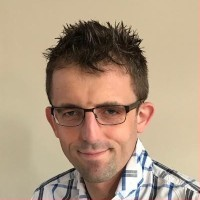

# Authors

The authors of this playbook are [**Bethan Timmins**](https://www.linkedin.com/in/bethan-timmins-3089369/) and [**Steve Smith**](https://www.linkedin.com/in/stevesmithtech/).

Bethan Timmins is a Principal Consultant and Managing Director for Equal Experts A&NZ, and is responsible for the growth and success of Equal Experts within Australia and New Zealand. With over 20 years experience working in software delivery across multiple sectors, her delivery experience has a focus on:

* understanding and articulating the product being built
* improving on the process to feed a delivery team
* increasing the flow and delivery of ideas through to customers

Bethan has played key roles in multiple digital transformation programmes globally, including one of the largest cloud migration projects in the UK government. Bethan was a finalist in the Women in IT Awards 2018 for her expertise in transformation, and is an advocate for getting more women into senior Tech roles.

 

**Bethan Timmins** 
 
Steve is a Principal Consultant and Practice Lead at Equal Experts, who advises clients worldwide on Continuous Delivery, operating models, and reliability.  

Steve has played key roles in multiple digital transformation programmes. He was a leader on a 60 team/600 microservices programme for a UK government department with £500Bpa revenue. He also implemented a Continuous Delivery and operability strategy for 30 teams/100 microservices in a high street retailer with £2Bpa online revenue. He's also written multiple books, such as [**Measuring Continuous Delivery**](https://www.amazon.co.uk/dp/B08LYZDPMK). 
 

**Steve Smith**