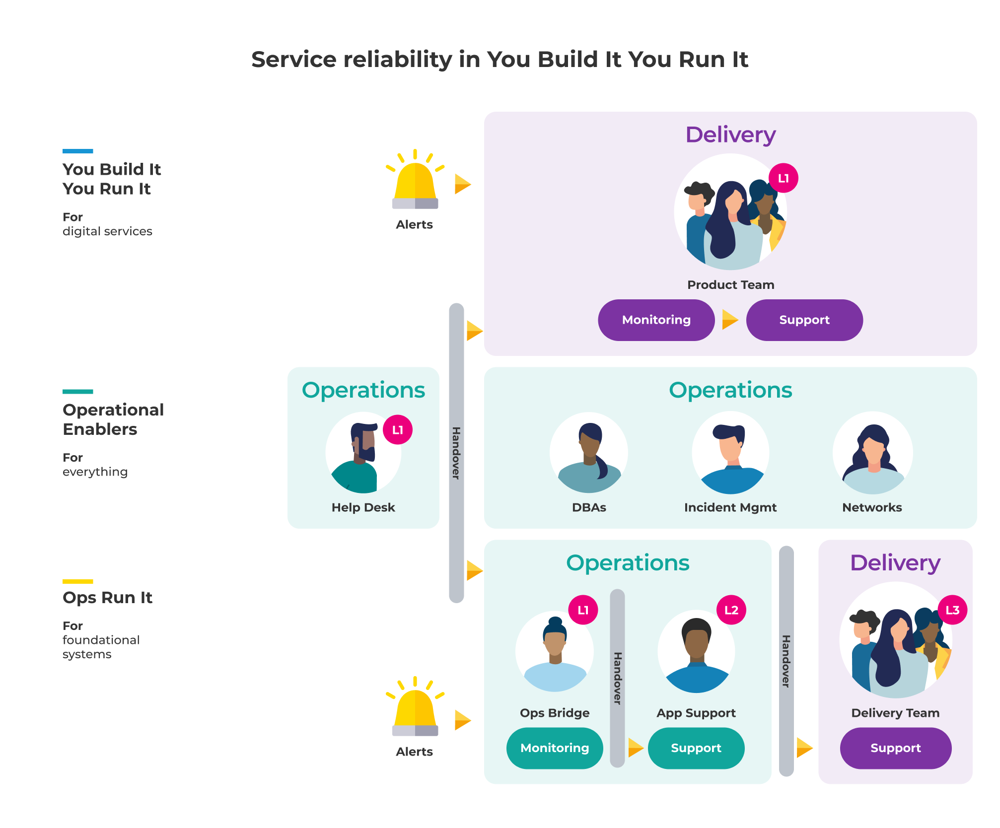

# Introduction

This playbook describes the You Build It You Run It operating model.

> *You Build It You Run It is an operating model in which product teams build, deploy, operate, and support their own digital services* 

At Equal Experts, we help organisations to achieve sustainable innovation. If your organisation has a similar ambition, you'll likely need improvements in:

* **Deployment throughput**. Digital services need to constantly evolve, to meet your changing customer needs in a competitive landscape. [*Accelerate*](https://www.amazon.co.uk/Accelerate-Software-Performing-Technology-Organizations/dp/1942788339) by Dr. Nicole Forsgren et al found organisations with a high deployment throughput were twice as likely to exceed profitability, market share, and productivity expectations.
* **Service reliability**. Digital services need to be consistently reliable, to protect your revenue, costs, and brand reputation. A [Fortune 1000 survey](https://www.devopsdigest.com/idc-survey-appdynamics-devops-application-performance) by IDC found the average cost of a critical failure was between $0.5M and $1M per hour.
* **Learning culture**. To foster high-performing teams, a culture of continuously creating insights and implementing improvements is required. [*A typology of organisational cultures*](https://qualitysafety.bmj.com/content/13/suppl_2/ii22) by Ron Westrum demonstrates that a stronger culture results in higher levels of trust, collaboration, and higher quality decision-making.  

These improvements are essential if you want to optimise your customer experience, achieve delivery excellence, and minimise your operational costs. Robert Charette estimated in [*Inside the hidden world of legacy IT systems*](https://spectrum.ieee.org/computing/it/inside-hidden-world-legacy-it-systems#.X1jgYXG4zEI.linkedin) that 75%, or $26.25 trillion of worldwide IT spending 2010-2020 was on operational expenditure. 

Many of our customers use the traditional operating model, of one or more operations teams doing deployments and providing production support. We call this [Ops Run It](https://you-build-it-you-run-it.playbook.ee/what-is-ops-run-it). We believe Ops Run It can't achieve the standards of deployment throughput, service reliability, and learning culture required for digital service management. This has been validated by Charles Betz of Forrester Research, who warns in [*The Future of Technology Operations*](https://www.forrester.com/report/The+Future+Of+Technology+Operations/-/E-RES154099?objectid=res154099) that ‘the old guard operating practices of ITIL, COBIT, PMBoK, and CMMI are rapidly losing relevance', and 'a plan/build/run lifecycle is no longer suitable'. 

[You Build It You Run It](https://you-build-it-you-run-it.playbook.ee/what-is-you-build-it-you-run-it) is a modern operating model. It's the de facto name for on-call product teams owning all aspects of their custom digital services, from inception to decommission. They launch to live traffic, monitor customer behaviours, and respond to production incidents themselves. You Build It You Run It transforms technology operations from reactive ticket management to proactive continuous improvement.

We recommend You Build It You Run It for higher demand digital services. Adopting You Build It You Run It means comprehensive changes for people, processes, and technology. It requires the creation of cross-functional teams who are responsible for development, testing, and production support of digital services. It means redefining roles, streamlining service management processes, and building a fully automated toolchain from deployment pipeline to incident management. 

**Figure 2: You Build It You Run It - deployment throughput**

**Figure 3: You Build It You Run It - service reliability**

**Figure 4: You Build It You Run It - learning culture**

We still advise using Ops Run It for lower demand COTS and foundational systems. A central operations team remains a cost-effective option where product feature demand is lower. This includes COTS, custom back office services, on-premise DNS and firewall management, etc. 

This means that modern technology operations equates to a hybrid operating model - You Build It You Run It for higher demand digital services, and Ops Run It for everything else.

## What is in this playbook

This playbook compares You Build It You Run It to Ops Run It. The comparison is in terms of deployment throughput, service reliability, and learning culture.

Deployment throughput is the production output for a service. It is expressed in terms of deployment frequency and deployment lead time. Creating a fully automated deployment pipeline and modernising ways of working accelerates the rate of production deployments. See [*Measuring Continuous Delivery*](https://leanpub.com/measuringcontinuousdelivery) by Steve Smith.
  
Service reliability is the ability of a service to function without failure. This is a narrow definition that omits functional correctness and customer experience. Service reliability can be expressed as an availability level, and time to restore availability. Improving the operability of a service increases its availability, by creating sources of adaptive capacity. See [*On adaptive capacity in incident response*](https://increment.com/reliability/adaptive-capacity-incident-response/) by John Allspaw et al. 

A learning culture is how people acquire new knowledge and skills, within the shared, implicit assumptions underpinning their social behaviours. It’s a cycle of never-ending improvement, based on generating insights and implementing improvements from deployment and availability problems. A strong learning culture empowers people to experiment, make more informed decisions, and collaborate on shared organisational goals. See [Continuous learning as a tool for adaptation](https://www.infoq.com/articles/series-enhancing-resilience-5) by Nora Jones.

Table 1 summarises the characteristics of You Build It You Run It and Ops Run It. 
