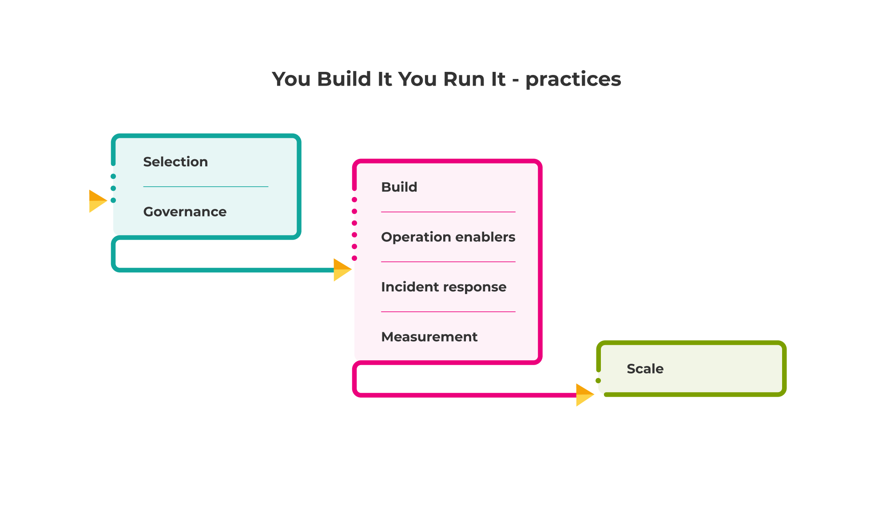

# Practices

The You Build It You Run It practices in this playbook are technology and vendor-agnostic, so you can determine the best adoption pathway based on the context of your organisation. While we're strong proponents of cloud computing, serverless, microservices, and open-source technologies, we've seen You Build It You Run It succeed in very different environments. 

Transitioning from Ops Run It to You Build It You Run It is a challenging process. There's no repeatable recipe, because every organisation is different and has its own unique context. We can simply offer a heuristic, which describes a sequencing of You Build It You Run It adoption that we've seen succeed before. It's important that you experiment with these practices, and gradually learn what the right approach is for your organisation.

**Figure 1: You Build It You Run It - practice groups**

We're sometimes asked by our customers for ways to reduce You Build It You Run It costs. It happens when running costs increase, due to more product teams requiring more remuneration for more out of hours on-call for more digital services. This request is understandable when one of the few Ops Run It benefits is low running costs. However, it's worth remembering Ops Run It also creates weak operability incentives for product managers and developers. 

Optimisations must protect operability incentives for product teams. The below practices achieve a delicate balance between incentives and running costs, such as downgrading availability targets in the months between peak business periods.  
