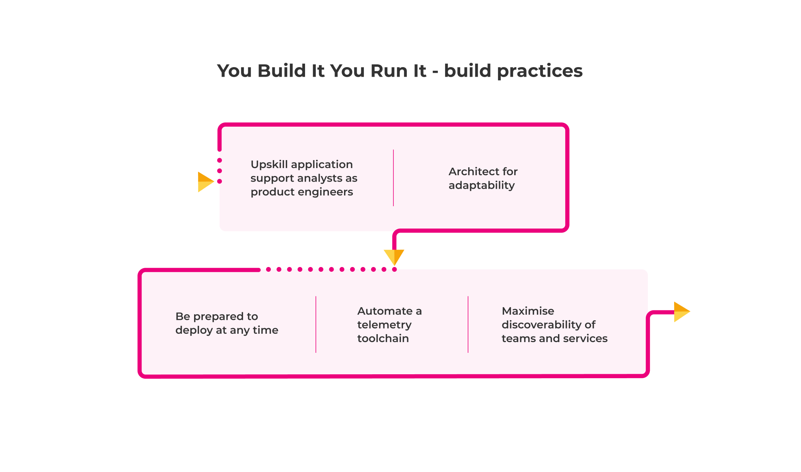

# Build

These practices design and build operability into digital services. Building a digital service that is easy to operate in production creates new sources of adaptive capacity, which can be utilised in abnormal operating conditions.

These practices link back to our principle of [operating models are most effective when rapid restoration comes first](../principles.md#operating-models-are-most-effective-when-rapid-restoration-comes-first). You might not need to implement all of these, but without a majority of them you'll suffer from the [excessive BAU pitfall](../pitfalls.md#excessive-bau).

## Upskill application support analysts as product team developers

If you're transitioning your digital services from Ops Run It, invest in your application support analysts and help them become product developers.

You Build It You Run It is all about incorporating operational knowledge into the design of digital services, and application support analysts are an invaluable source of such knowledge. They have a deep appreciation of operating conditions, live traffic management, and historical incidents. Upskilling analysts allows them to contribute their institutional knowledge to building operability into digital services. For example, ex-analysts with prior on-call experience can teach other product team developers how to refine alerts and minimise unnecessary callouts.

Upskilling analysts is a significant investment. We recommend creating opportunities for motivated, skilled employees interested in new career pathways. We'd adopt a gradual pace using learning materials and pair-programming, to minimise disruption for your product teams and operations teams alike. We'd encourage shadowing and knowledge sharing sessions within product teams, to avoid application support analysts being isolated as [embedded specialists pitfall](../pitfalls.md#embedded-specialists).

You Build It You Run It creates new opportunities for your application support analysts. They can remain in an operations team committed to COTS and foundational systems, and increase their technical mastery. Alternatively, they can join a product team dedicated to a digital service, and learn how to use software delivery skills to solve business problems. Some of the best product team developers we've worked with have a background in Ops Run It.

## Architect for adaptability

Design loosely-coupled product teams and loosely-coupled digital services, to enable graceful degradation when a production failure inevitably occurs. This allows customers to partially use your digital services, and your business outcomes to be partially realised, while full availability is restored in the background.

Architecting for adaptability also protects an on-call product team from excessive BAU. Minimising service dependencies and the blast radius of anticipated failures allows a product team to prioritise availability protection over planned feature development, because there's a high standard of service reliability, which results in a low level of BAU work.

This is deeply contextual, and it varies from one digital service to another. For example, a digital service could comprise a modular monolith of many business functions, or multiple microservices per business function. Empower product teams to make their own choices, reduce failure blast radius, and remove inter-team overheads in deployment orchestration and/or incident response wherever possible.

Architecting for adaptability takes many forms:

* _Eliminate avoidable service dependencies_. Draw the bounded context of a digital service to ensure minimal dependencies on other digital services and third party systems.
* _Soften unavoidable service dependencies_. Ensure communications with downstream digital services and third party systems are via asynchronous queues, bulkheads, circuit breakers, on the wire caches, and rate limiters wherever appropriate.
* _Create availability redundancy_. Leverage cloud infrastructure to establish multi-zone availability for digital service workloads, followed by multi-region availability if necessary.
* _Set up single team ownership for digital services_. Design product and technology boundaries so one on-call product team has exclusive write access to the code repositories, configuration, and more for a digital service. One team can own multiple digital services, but a digital service can only have one owning team.
* _Establish single service ownership for databases_. Create database infrastructure so one digital service has exclusive read and write access to a relational or non-relational database. A digital service can use multiple databases, but a database instance can only have one digital service consumer.
* _Share behaviours via APIs not closed-source libraries_. Prevent the use of closed-source code libraries by mandating open-source code libraries for infrastructure code reuse, and digital services for business logic reuse. See [Don't share libraries among microservices](https://blog.philipphauer.de/dont-share-libraries-among-microservices/) by Philip Hauer.
* _Shutter a service on failure_. Create user-friendly shutter pages to replace API and frontend entry points for a digital service for when it is entirely unavailable.
* _Shift some incident resolution onto customers_. Experiment with self-service fix actions and chatbots to introduce L0 customer support. We see this infrequently, when on-call costs have been incurred in a repeatable failure scenario that cannot easily be eliminated.

Pressure to create faster, better, cheaper digital services actively undermines efforts to increase organisational resilience. It's important to always consider long-term extensibility alongside short-term gains. See [An interview with David Woods](https://increment.com/reliability/resilience-engineering-david-woods/) by Ipsita Agarwal.

## Be prepared to deploy at any time

Ensure a digital service is always deployable. This means a monolith or a set of microservices are always passing their automated functional tests, always ready to be signed off in exploratory testing, and always prepared to go through a deployment process into production. This includes:

* _XP development practices_. Gradually introduce pair-programming, test-driven development, Trunk Based Development, and Continuous Integration into product teams.
* _Deployment pipelines_. Create fully automated deployment pipelines for all activities between code commit and production deployment.
* _Parallelised functional tests_. Use dynamic test data and prime test runners to run suites of functional tests in parallel.
* _Zero downtime deployments_. Establish blue-green deployments, canary deployments, and/or dark launching to put new product features in front of customers in the day time, without any availability loss.
* _Fast revert on failure_. Allow a failed build, test suite, or deployment to be immediately reverted within seconds of failure detection.

The ability to deploy at any time enables a rapid incident response. As usual, we recommend a product team experiments with different approaches until the right fit is found. It's possible you won't need all of these in your organisation.

## Automate a telemetry toolchain

Encourage on-call product teams to fully automate a telemetry pipeline, and continually refine their loggable, monitorable, and alertable events. Complex digital services can interact in unexpected and surprising ways. It's vital that on-call product team members can quickly identify, and diagnose abnormal operating conditions. This includes:

* _Logging_. Implement a logging stack like [Elastic](https://www.elastic.co/) + [Fluentd](https://www.fluentd.org/) + [Kibana](https://www.elastic.co/kibana/) (EFK) to process logs, and visualise events in dashboards.
* _Monitoring_. Install a monitoring stack like [Victoria Metrics](https://victoriametrics.com/) + [Grafana](https://grafana.com/) to process metrics, and visualise business and technical events in dashboards. Commercial tools like Appdynamics and [New Relic](https://newrelic.com/) are also available. See [Scaling to trillions of metric data points](https://engineering.razorpay.com/scaling-to-trillions-of-metric-data-points-f569a5b654f2) by Venkat Vaidhyanathan _et al_.
* _Alerting_. Use an alerting stack like [vmalert](https://docs.victoriametrics.com/vmalert.html) + [Alertmanager](https://www.prometheus.io/docs/alerting/latest/alertmanager/) to fire alerts from logs or metrics, based on configurable alert definitions defined as code.
* _Incident response_. Use an incident response platform like [PagerDuty](https://www.pagerduty.com/) or [VictorOps](https://www.splunk.com/en\_us/investor-relations/acquisitions/splunk-on-call.html) to consume alerts in order to notify on-call product team members, and register incidents in a ticketing workflow system like [ServiceNow](https://www.servicenow.co.uk/).
* _Incident collaboration_. Use a collaboration platform like [Slack](https://slack.com/intl/en-gb/) for product team members to effectively communicate during production incidents.

We recommend a telemetry pipeline is built just like any other automated deployment pipeline. The goal is for dashboard updates, out of hours callouts, and incident ticketing to happen automatically without any human intervention.

## Treat unplanned operational rework like planned work

Manage unplanned operational tasks for live digital services in a similar way to planned product and operational features. This ensures urgent operational faults can be quickly rectified, without causing too many delays to planned work.

We've heard unplanned operational rework described as 'BAU work'. Essentially, it's any operational task that hasn't been planned for by the product manager. This might include investigating an intermittent alert, fixing a deployment failure, or adding more infrastructure capacity. Manage these tasks as follows:

* _Visualise rework items_. Add a swimlane onto the team board for unplanned operational tasks, alongside swimlanes for planned product and operational features.
* _Allocate a team member to handle rework items_. Ensure a product team member is available in working hours to:
  * Add newly uncovered operational tasks to the product team board
  * Complete urgent operational tasks as soon as possible
  * Add non-urgent operational tasks to the backlog for prioritisation
* _Measure the impact of rework items_. Track how much time per week is spent on unplanned operational tasks, and check for an upwards trend correlating with a decline in deployment throughput and/or service reliability. For more on this, see Rework Rate measurements in [Accelerate](https://www.amazon.co.uk/Accelerate-Software-Performing-Technology-Organizations/dp/1942788339), by Nicole Forsgren _et al_.

## Maximise discoverability of teams and services

Visualise all your product teams and their digital services, in an information portal that any authenticated person can access. This creates a centralised source of truth for key characteristics of digital services, such as which team owns which service and measures of success.

An information portal is the backbone of alert routing, progress reporting, and urgent information lookups during production incidents. It's essential at scale, and in that scenario we build a service catalogue as part of a digital platform. See our [Digital platform playbook](https://app.gitbook.com/s/-MJRM-IVRZ9C6iJCPG9o/introduction) by Adam Hansrod _et al_.

We're sometimes asked by our customers if there's an open-source or COTS information portal out there. We recommend a portal be built from scratch, as it's incredibly valuable to constantly curate information for an entire organisation on business metrics, reliability measures, and acquired operational knowledge.

| Securing You Build It You Run It in retail                                                                                                                                                                                                                                                                                                                                                                                                                                                                                                                                                                                                                                                                                                                                                                                                                                                                                                                                                                                                                                                                                                                                                                                                                                                                                                                                                                                                                                                                                                                                                                                                                                                                                                                                                                                                                                                                                                       |
| ------------------------------------------------------------------------------------------------------------------------------------------------------------------------------------------------------------------------------------------------------------------------------------------------------------------------------------------------------------------------------------------------------------------------------------------------------------------------------------------------------------------------------------------------------------------------------------------------------------------------------------------------------------------------------------------------------------------------------------------------------------------------------------------------------------------------------------------------------------------------------------------------------------------------------------------------------------------------------------------------------------------------------------------------------------------------------------------------------------------------------------------------------------------------------------------------------------------------------------------------------------------------------------------------------------------------------------------------------------------------------------------------------------------------------------------------------------------------------------------------------------------------------------------------------------------------------------------------------------------------------------------------------------------------------------------------------------------------------------------------------------------------------------------------------------------------------------------------------------------------------------------------------------------------------------------------ |
| 
We worked in a large merchandise retailer, building an encryption service to protect sensitive data. This included personal data, database encryption keys, and mobile payment keys. We chose to implement You Build It You Run It because the pressure to keep our services available was very high, and our infrastructure was complex. It would have been difficult to pass our services over to a separate operations team.  We made the alert system for this infrastructure quite sensitive, so we could catch all sorts of problems. However, it didn't have the desired effect. Some alerts were too sensitive due to brief vendor instabilities, which we couldn't fix during callouts. It decreased our attentiveness to alerts to some extent, and tired out the team. After that, we concluded we should only receive alerts that are actionable.  We made the decision to move to service level objectives (SLOs) for our alerts. This benefited the team a lot, as clear availability targets and priorities reduced unnecessary stress.  Our alerts were also a great tool to improve our services. As we were investigating alerts, we were often able to quickly fix the underlying problems. We then realised we should extend these practices to disaster recovery, which was a great tool for bringing the whole team up to the same level of understanding.  From this experience, I learnt that You Build It You Run It practices are worth investing in, as it is easier to react to a problem when you are woken up at night if you've practiced common failure patterns. When our team had new team members, we were always eager to bring them up to speed by putting them on-call.    <a href="https://www.linkedin.com/in/natalia-oskina/">Natalia Oskasina</a> Developer EE UK
 |
