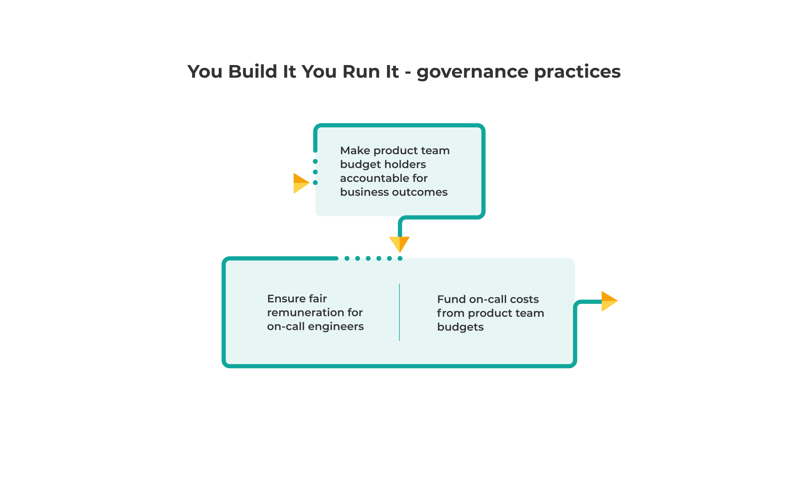

# Governance

You Build It You Run It governance is a radical departure from Ops Run It. These practices are a clear, long-term commitment to You Build It You Run It. They're hard to implement, but if none of them are put in place it's unlikely your on-call product teams will be successful. Here's an approximate sequencing to implementing governance practices.

These practices are linked to our principles of [operating models are insurance for business outcomes](https://you-build-it-you-run-it.playbook.ee/principles#operating-models-are-insurance-for-business-outcomes) and [operating models are powered by feedback](https://you-build-it-you-run-it.playbook.ee/principles#operating-models-are-powered-by-feedback). 

## Make product team budget holders accountable for business outcomes

Empower the budget holders for product teams to be accountable for deployment throughput, service reliability, and the learning culture for their digital services. The budget holder for a product team will be one of:

* Your Head of Product, if team funding comes from a product budget
* Your Head of Delivery, if your organisation has separate Product and IT departments and team funding comes from an IT budget

Making this change encourages the budget holders to translate business goals into operational objectives, incorporate customer feedback into development activities, and strike a balance between delivering product features and operational features. They devolve responsibilities such as availability target selection and on-call support to their product teams. 

This is a radical departure from Ops Run It, in which the Head of Operations is accountable for the reliability of all software services. The Head of Operations retains accountability for foundational systems in You Build It You Run It. We recommend this [RACI model](https://racichart.org/the-raci-model/):

|Category|Head of Operations|App Support team|Head of Product|Head of Delivery|Product teams|
|---|---|---|---|---|---|
|Digital services reliability<ul><li>Availability</li><li>Support</li><li>Telemetry</li><li>Reporting</li></ul>|I|I|A for product funded services|A for IT funded services|R|
|Foundational systems reliability<ul><li>Availability</li><li>Support</li><li>Telemetry</li><li>Reporting</li></ul>|A|R|I|I|I|

Operability incentives are maximised for product teams when their budget holders are accountable for live support. If this practice isn’t implemented, you’ll suffer from the [responsible but unaccountable pitfall](https://you-build-it-you-run-it.playbook.ee/pitfalls#responsible-but-unaccountable).

## Fund on-call costs from product team budgets

Pay for on-call support for a digital service from the product team budget. This means the product team budget holder pays for:

* *On-call standby costs*. Compensation for one or more product team members making themselves available in case of an out of hours incident. This is part of the ongoing run cost.
* *On-call callout costs*. Compensation for one or more product team members responding to an out of hours incident. This is a per-incident cost.

If the on-call opex budget is owned by your Head of Operations, transfer their budget line item for digital services into an on-call capex budget allocated to the product team budget holders. Split the on-call capex budget into a line item per digital service, and allocate each line item to the corresponding product team. This maximises incentives for each product team budget holder to:

* Establish desired business outcomes prior to any development efforts.
* Choose an appropriate availability target that balances business outcomes insurance with a run cost estimate.
* Prioritise the protection of live product functionality alongside the delivery of new product features.
* Lend their credibility to organisational changes that improve on-call experience, such as product teams automating their own telemetry toolchains. 
* Incorporate graceful degradation and adaptability into the customer experience.

If on-call funding for digital services stays with your Head of Operations, you’ll suffer from the [responsible but unaccountable pitfall](https://you-build-it-you-run-it.playbook.ee/pitfalls#responsible-but-unaccountable).

## Ensure fair remuneration for on-call developers

Offer a level of pay to on-call developers for 24x7 support that recognises the inconvenience of out of hours support. We recommend choosing one of these payment models, based on your own organisational context:

|Name|Remuneration|Comments|
|---|---|---|
|Standby payment only|Pay a flat rate per hour/day/week for a developer to be ready out of hours for an incident|This model is easy to communicate and implement for cost tracking. The flat rate can be calculated based on the product lifecycle and prior incidents, or simply chosen as an arbitrary amount. See [How we've evolved on-call at Monzo](https://monzo.com/blog/how-weve-evolved-on-call-at-monzo) by Shubheksha Jalan|
|Standby and callout payment|Pay a flat rate per hour/day/week for a developer to be ready out of hours for an incident, and pay a flat rate per hour for incident response|This model has more complicated cost tracking. It needs callout payments to be carefully designed, in order to incentivise a rapid incident response|

We don't recommend callout payments only, as it's unfair remuneration. It's important to compensate your L1 on-call developers for the disruption that on-call standby causes to their lives outside of work. Always being available via phone, pager, and/or laptop out of hours has an impact on people.

Changing remuneration means updating contracts with suppliers and employees, to recognise 24x7 L1 support as a paid activity for product team developers. This can be a difficult process, and there's no one right answer on how much to pay. Transparency during this process is important, so people can understand the available funding. There's a lot of variability in how organisations approach this. See [2019 On-call compensation survey](https://oncall.netlify.app/) by Spike Lindsey *et al*. 

We've listened to senior managers in different organisations say that You Build It You Run It payment models are too expensive compared to Ops Run It, particularly if operations teams are [outsourced to a third party managed service for lower costs](https://you-build-it-you-run-it.playbook.ee/what-is-ops-run-it/benefits#service-reliability). It's a flawed comparison, because operating models are insurance for business outcomes. You Build It You Run It has a more cost effective premium than Ops Run It for digital services, where higher standards of deployment throughput and service reliability are required. Ops Run It remains the right choice for COTS applications. 

Your product team developers already have intrinsic motivation to be on-call. It's vital they have an extrinsic motivation as well, that recognises their contribution to your organisation out of hours. This is hard to put into place, but if it doesn't happen people will decline to do on-call and you'll be in the [limited on-call schedule pitfall](https://you-build-it-you-run-it.playbook.ee/pitfalls).

|Managing on-call at John Lewis & Partners|
|---|
|In 2020, the product team responsible for registration and authentication at John Lewis & Partners was delivering a roadmap to decommission a legacy system, and introduce an integration with a third party identity provider.  The team began to launch features involved in the checkout process, which were dependent on the new identity provider. This meant resolving high profile incidents involving lost sales became part of their world.  Over two weeks, we met several times as a team to decide what we wanted our out of hours support to look and feel like.This included updating our runbooks, dashboards, and logging. We reviewed the incident management process, and agreed amongst ourselves how we defined an on-call shift.  The knowledge the team was the first and last line of defense for registration and authentication, at any hour of any day, was baked into every line of code. Did that mean we had no incidents? Definitely not. But when incidents were resolved, we could quickly implement any improvement actions to avoid a repeat incident.  Things that worked well included:<ul><li>Mutually supporting some team members who were more nervous about running out of hours support.</li><li>Regularly debriefing alerts, to establish a common view of what could happen.</li><li>Building positive relationships with the operations teams supporting the legacy systems we were replacing.</li><li>Performing dry alert runs, to decide which alerts to configure for out of hours notifications.</li><li>Documenting exactly how to raise an incident with a specific third party provider.</li></ul>Learning how to work with the third party provider was particularly important. We figured out that asking them what made a support ticket useful would help us to get a useful response in the first instance, rather than wait for multiple delays.    [Erin O'Connor](https://www.linkedin.com/in/deliveredge/) Delivery Lead EE UK|