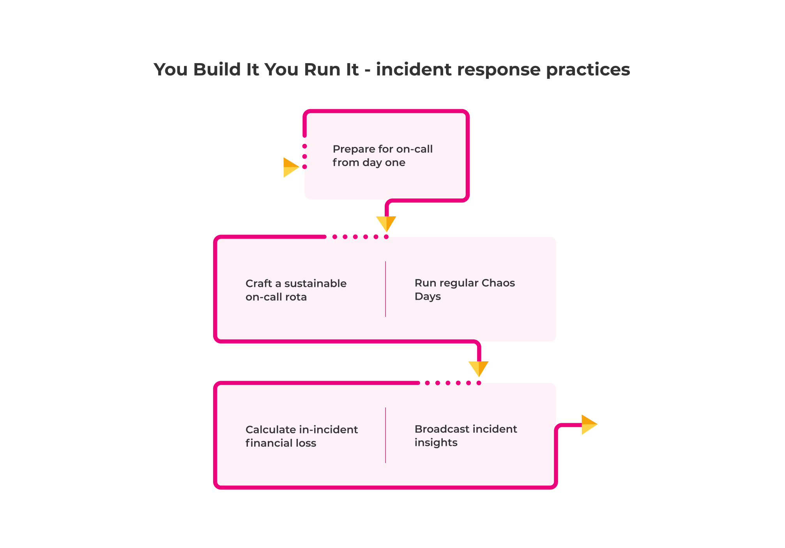

# Incident response

These practices relate to responding to incidents, and learning from incidents. One of the drawbacks of You Build It You Run It is its [high setup cost](https://you-build-it-you-run-it.playbook.ee/what-is-ops-run-it/drawbacks), and part of that is a steep learning curve for product teams. It's important they're prepared to identify, resolve, and learn from production incidents, before their first incident occurs. If these practices aren't implemented, you'll have unprepared incident responders and they'll fall into the [excessive BAU](https://you-build-it-you-run-it.playbook.ee/pitfalls#excessive-bau) and [limited on-call schedule pitfalls](https://you-build-it-you-run-it.playbook.ee/pitfalls#limited-on-call-schedule). 

These practices link back to our principle of [operating models are effective when rapid restoration comes first](https://you-build-it-you-run-it.playbook.ee/principles#operating-models-are-most-effective-when-rapid-restoration-comes-first).

## Prepare for on-call from day one

Set on-call expectations in product teams from the moment they start to build digital services. This maximises incentives for product team members to build operability into product features. It gives them time to adjust to a new mindset, in which they could be called out at 0300 to fix their own work.  

On-call preparation includes:

* *Inception*. Work with the product manager and intended users to understand the required availability level, and how best to gracefully degrade upon unavailability. See our [Inception Playbook](https://inception.playbook.ee/) by Neha Datt *et al*.	
* *Team skills*. Balance the skillsets of different product team members - frontend developers, backend developers, testers, and more - to create enough capacity for on-call incident response later on.
* *Runbook*. Start a runbook on day one, and update it weekly with anticipated failure scenarios, failure mitigations, alert thresholds, and step by step guides.
* *Telemetry*. Update logging dashboards, monitoring dashboards, and alert definitions for every product feature. Encourage product team members to check dashboards daily.
* *Onboarding*. Set on-call expectations with prospective team members before they join. Assign telemetry and incident response permissions to new product team members as soon as they join. 
* *Escalation path*. Ensure product team members have clear communication pathways for major incidents. Make it easy to nominate an incident manager as incident commander for out of hours incidents. 
* *Learning mindset*. Foster a no-blame culture of collaborative learning for production incidents. Promote an emphasis on creating new knowledge for the entire organisation.

These changes can be difficult to implement when you have a tight launch deadline for a new digital service. It's important to make them a bit at a time, starting from day one.

## Craft a sustainable on-call schedule

Encourage a product team to manage an out of hours on-call schedule, which safeguards the reliability of digital services and preserves work-life balance for product team members.

We recommend:

* A minimum of three product team members participating in the on-call schedule
* All product team members are encouraged to participate in the on-call schedule, regardless of role
* A default on-call rotation of one week for each on-call participant

How product team members help each other to manage the on-call schedule is vital to success. Some team members may be unable to do on-call for family or health reasons, and their decisions need to be respected. Some team members may be reluctant due to a lack of preparation, and any such problems need to be solved.

## Run regular Chaos Days

Inject failures into digital services to validate they have been [architected for adaptability](https://you-build-it-you-run-it.playbook.ee/practices/build#architect-for-adaptability). Enable product teams to hone their incident response skills, prior to any actual production incidents. 

Run day-long events that introduce failures into your digital services. Encourage your product teams to reduce the blast radius of latent faults, refine their mental models, and build up relationships with dependent teams. If your production environment can't handle a controlled level of stress, run a Chaos Day in a test environment. 

To find out more about running Chaos Days in large enterprise organisations, see our [Chaos Day playbook](https://chaos-day.playbook.ee/) by Lyndsay Prewer. 

## Calculate in-incident financial losses

Estimate the costs incurred and revenue lost during a production incident, and prioritise incident response based on that financial loss. Ensure product teams understand what is, and isn't, a major incident that requires swarming and an urgent resolution.

You Build It You Run It is based on an understanding of the financial exposure attached to a digital service. We've worked with many customers where incident financial loss is only calculated for the post-incident review, if at all. As a result, an entirely subjective incident priority is used to guide the incident response process, and there's a lot of uncertainty over what is and isn't a major incident. 

Shifting that financial loss calculation left to the start of an incident clarifies how to approach incident response. It's a simple categorisation method, which avoids people wasting incident response time debating if an incident is a P1, a P2, or a P3. 

We recommend calculating incident loss at the start of an incident, when costs incurred and/or revenue loss are first understood. Revise the calculation as and when new information on losses is available. That financial loss estimate can then be used to select an incident response method:

|Incident Financial Loss|Incident Examples|Incident Type|Incident Response Method|
|---|---|---|---|
|High|<ul><li>Users cannot complete a user journey</li><li>Users affected by a security incident</li></ul>|Major|Restore availability immediately|
|Medium|<ul><li>Users can complete a degraded user journey</li><li>Users affected by degraded performance</li></ul>|Minor|Restore availability by next working day|
|Low|<ul><li>Users can complete a user journey</li><li>Users partially affected by degraded performance</li></ul>|Minor|Restore availability when possible, add ticket to backlog|

This is always contextual, and dependent on examples. What constitutes a high financial loss per incident varies from one organisation to another. 

## Broadcast incident insights

Share incident insights and new discoveries with your entire organisation. Ensure on-call product teams respond to future incidents with the full knowledge of your organisation at their disposal. 

You Build It You Run It encourages a growth mindset. Digital services are inherently imperfect, and a production failure implies a set of circumstances that were unanticipated or poorly understood. The only way for product teams to understand and improve what's not understood and needs improvement is to create more learning experiences.

Distribute the insights from a post-incident review to your entire organisation, as follows:

* Publish the incident report on an internal incident reporting site, and announce it on your collaboration platform e.g. Slack. 
* Link out to the incident report from the incident ticket in your incident response platform, your ticketing system, and in your [information portal](https://you-build-it-you-run-it.playbook.ee/practices/build#maximise-discoverability-of-teams-and-services).
* Host one or more internal brown bag sessions for product teams to walk through the incident as it unfolded, and discuss incident insights.
* Ensure senior leaders encourage thorough post-incident reviews, and spread knowledge themselves throughout the organisation to benefit different product teams. 

Broadcasting incident insights means scarce, proprietary knowledge can reach those who need it most. The more information you share between product teams, the more collaboration and trust you'll foster.

|The support toolchain for You Build It You Run It at a payments provider|
|---|
|We were engaged by one of the leading EMEA payments providers to build a payment gateway which could be white labelled for each tenant. The payments gateway was launched in multiple countries, with different payment integrations for different tenants.  The product team responsible for building the payments gateway was also responsible for running on-call support. Understanding the product features helped us to surface and monitor the right metrics. We also built an extensible alerting system, which could be configured for each tenant. When a new tenant was onboarded, a default alerting profile was assigned to them. The alerting profile was then gradually updated, based on the transaction volume and payment features opted into by the tenant. This helped to avoid false alerts.  Since the same team was responsible for building and running the payments gateway, we iterated on metrics and alerts as part of every feature cycle. We ensured every request was traced across services and external integrations. Dashboards were built for every alert, to reduce the response time for them. When the alerts were triggered, the product team was notified along with the right dashboards. Being on-call gave us an accurate context to prioritise and fix errors as they occurred.    [Anant Pal](https://www.linkedin.com/in/anantkpal/) Anant Pal EE India|