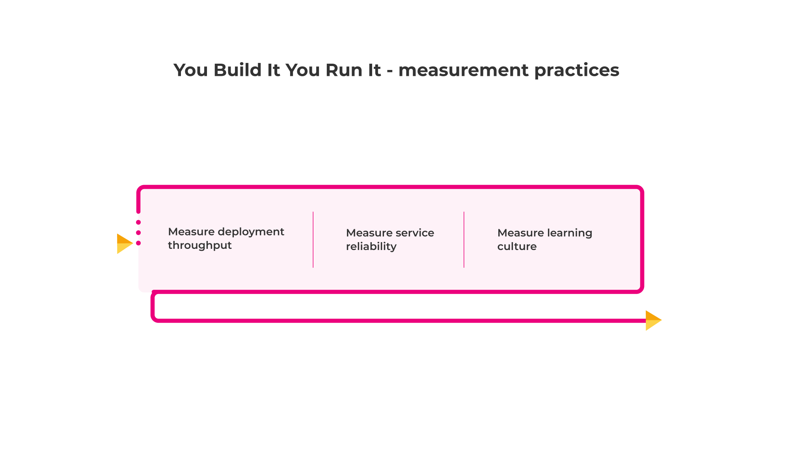

# Measurement 

These practices measure an operating model to decide if it’s worthy of further investment. The cost effectiveness of business outcome protection is an informative, actionable measure of an operating model. 

Leading and trailing measures can be used to gauge progress in deployment throughput, service reliability, and learning culture. It’s important to select measures that are holistic, actionable, and do not create the wrong incentives. See [*Measuring Continuous Delivery*](https://www.amazon.co.uk/dp/B08LYZDPMK) by Steve Smith.

**Figure 13 - measurement practices**

These practices are linked to our principles of [operating models are insurance for business outcomes](https://you-build-it-you-run-it.playbook.ee/principles#operating-models-are-insurance-for-business-outcomes) and [operating models are powered by feedback](https://you-build-it-you-run-it.playbook.ee/principles#operating-models-are-powered-by-feedback).

## Measure deployment throughput

Measure the deployment throughput of digital services as:

|Measure|Type|Description|Suggested Implementation|
|---|---|---|---|
|Loose Coupling|Leading|Is a product team able to change a digital service without orchestrating simultaneous changes with other digital services|Inspect deployment history. Calculate how many deployments of different digital services occurred in lockstep|
|Pre-Approved Changes|Leading|Does a product team have permission to pre-approve its own change requests for low risk, repeatable changes|Inspect ticketing system. Calculate how many digital services have pre-approved change request templates|
|Deployment Lead Time|Trailing|How long does a release candidate for a digital service take to reach deployment|Instrument deployment pipeline. Calculate days from production deployment back to build date|
|Deployment Frequency|Trailing|How often are digital services deployed to customers|Instrument deployment pipeline. Calculate rate of production deployments|

**Table 12: deployment throughput measures**

### Measure service reliability

Measure the reliability of digital services as:

|Measure|Type|Description|Suggested Implementation|
|---|---|---|---|
|Failure Design|Leading|Does a digital service include bulkheads, caches, circuit breakers|Survey product teams. Are they confident they can cope with downstream failures|
|Service Telemetry|Leading|Does a digital service have custom logging, monitoring, and alerts|Survey product teams. Are they confident they can quickly diagnose abnormal operating conditions|
|Availability|Trailing|What is the availability rate of a digital service, as a Nines Of Availability e.g. 99.9%|Instrument digital services. Calculate percentage of requests that are fully or partially successful
|Time To Restore Availability|Trailing|How long does it take to re-attain an availability target once it has been lost|Instrument digital services. Calculate minutes from loss of availability target to re-attainment of availability target|
|Financial Loss Protection Effectiveness|Trailing|What amount of expected financial loss per incident is protected by a faster than expected Time To Restore Availability|Instrument digital services and incident financial losses. Calculate maximum incident financial loss, up to time to restore allotted by availability target. Calculate percentage of maximum incident financial loss protected by a time to restore faster than allotted by availability target|

**Table 13 - service reliability measures**

Financial loss protection effectiveness is a measure we’ve used with customers to gauge the cost effectiveness of You Build It You Run It at scale. It’s a check of projected financial loss per incident that is unrealised, because the actual time to restore is faster than the projected time to restore. It’s a comparison that can be made between digital services, product teams, and even operating models.  

## Measure learning culture

Coming soon

|You Build It You Run It on the Xinja banking platform|
|---|
|This customer was a fintech startup, with very limited money and skilled employees. It was a greenfield project in every sense, including business processes as well as technical implementation. I worked on the single technical team responsible for delivery, and therefore the onus of the entire system was on us. It was the classic case for You Build It You Run It.  To achieve this, automation was key. Adoption of Continuous Delivery enabled us to focus our energy on development, not deployments. All our changes were tested and deployed through a single automated pipeline, for simplicity and ease of tracking. Operational tasks needed to be in code as well, to allow for seamless deployments of infrastructure and application changes.  Monitoring and system reliability were at the heart of the system design as well, since reduced issues meant more time for development. Code quality and system health awareness checks also steered the interests of our team.  Since the business and operational knowledge was contained within our team,  the customer only needed to contact us to raise their issues.  This meant issues were resolved rapidly, and learnings from the issues were fed back into the design, testing and monitoring of the system. 
    [Adrian Ng](https://www.linkedin.com/in/adrian-ng-8558025/) Developer EE Australia|