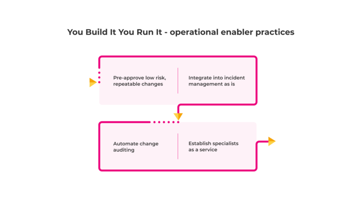

# Operational Enablers

These practices allow on-call product teams to collaborate effectively with operational enabler teams. This includes:

* Integrating digital services into service management processes for change management, incident management, and more.
* Working with specialist teams such as database administrators and network administrators.

You Build It You Run It co-exists with Ops Run It, as a hybrid operating model. Product teams use the same workflows that operations teams use for COTS and foundational systems. This helps operations teams to buy into product teams managing their own digital services, and it drives consistent behaviours across your organisation.

Product teams have the incentives and technical skills to automate integration touchpoints. They collaborate with operational enabler teams to implement fully automated workflow schemes for digital services. Over time, COTS and foundational systems can be migrated to the same workflow schemes, and everyone benefits from faster, more reliable service management. 

**Figure 9 - operational enabler practices**

These practices are based on our principle of [operating models are selected on financial exposure and product feature demand](https://you-build-it-you-run-it.playbook.ee/principles#operating-models-are-selected-on-financial-exposure-and-product-feature-demand). If you're unable to establish them, you'll suffer from the [Operations treacle pitfall](https://you-build-it-you-run-it.playbook.ee/pitfalls#operations-treacle).

## Pre-approve low risk, repeatable changes

Establish pre-approved change requests for low risk and repeatable changes. Continue to use change approvals for high risk and/or unrepeatable changes. In ITIL v3, this is the difference between standard changes and normal changes. This ensures regular, automated production deployments performed by an on-call product team can happen in a timely fashion. 

Integrate into these change management actions:

* Allow a product manager to create a pre-approved change request template for a digital service.
* Automatically raise a change request when the last pre-production activity is successfully completed:
    * For a low risk and repeatable change, complete a pre-approved change request.
    * For a high risk or unrepeatable change, send a change request to a change manager for approval. 
* Automatically check prior to a production deployment that an approved change request exists, and do not permit a deployment if none is found.
* Automatically close the change request when the production deployment is completed.

This facilitates a high proportion of low risk changes for a digital service, and a regular cadence of successful production deployments. 

## Integrate into incident management as is

Automate incident management touchpoints into your ticketing system. This allows an on-call product team to manage their own incidents with minimal friction, and demonstrates a long-term commitment to collaborating with major incident managers.

Integrate into these incident management actions:

Notify an on-call product team member when an alert is fired.
Create an incident in the ticketing system when an alert is fired.
Acknowledge an incident in the ticketing system when an on-call product developer is available.
Reassign an incident to a different digital service, COTS application, or foundational system when necessary.
Notify an incident manager when an incident is declared as a major incident.
Update an incident in the ticketing system when in-progress notes are available.
Resolve an incident in the ticketing system when an alert is resolved.

We recommend paying for a SaaS incident response platform such as [PagerDuty](http://www.pagerduty.com/) or [VictorOps](http://www.victorops.com). An incident response platform orchestrates alert notifications for on-call product teams, which means an on-call product developer can be notified of an alert in under a minute. It can manage an out of hours schedule for incident managers as well as product teams, which means an on-call developer can quickly contact someone for advice during a major incident. It can also offer bi-directional updates between its own alerts and incidents in your ticketing system. This removes hours of manual efforts on tickets, and ensures high quality records are preserved.

**Figure 10 - integrating into incident management as is**

It takes time to integrate You Build It You Run It into the same incident management process as Ops Run It, and we've seen it pay off multiple times. We've witnessed dramatic reductions in time to acknowledge and time to resolve an incident, and improvements in ways of working between different teams.

## Automate change auditing

Build each deployment pipeline as a fully automated compliance tool for change management. Accelerate change feedback loops from weeks or months into minutes.

Use a version control system such as [GitHub](https://github.com/) to store all updates to:

* Alert definitions
* Code
* Configuration 
* Infrastructure definitions
* Logging dashboards
* Monitoring dashboards
* Reference data

Audit in every deployment pipeline:  

* The versions of your digital services currently deployed in which environments
* The updates in your version control system that can be traced back from different versions of your digital services
* The deployment timestamps, deployer names, and approved change requests for production deployments
* The deployment lead time and deployment frequency for production deployments 

This is one way to implement compliance as code. Work with your change managers to understand the reports they need to satisfy internal compliance requirements. Free them up to tackle higher value work, such as orchestrating production deployments of foundational systems. 

## Establish specialists as a service

Turn the skill sets of specialised operations teams into consumable services. This creates a balance between breadth of cross-functional product teams and depth of specialist expertise in operational areas. 

Some operations teams possess scarce and highly valued engineering capabilities. The usual example we see is a few database administrators managing an on-premise relational database, for multiple product teams operating digital services in a cloud provider. The answer isn't to cross-train developers, or hire more database administrators. It's to eliminate repeatable work by migrating databases into your cloud provider, and by creating self-service deployment pipelines for your product teams. 

Offloading and automating database tasks frees up your database administrators to provide high value expertise on demand, such as troubleshooting live performance problems. For more on this, see [A guide to Specialists as a Service](https://www.equalexperts.com/blog/our-thinking/a-guide-to-specialists-as-a-service) by Bethan Timmins.

**Figure 11 - DBA specialists as a service**

|The support toolchain for You Build It You Run It at a payments provider|
|---|
|We were engaged by one of the leading EMEA payments providers to build a payment gateway which could be white labelled for each tenant. The payments gateway was launched in multiple countries, with different payment integrations for different tenants.  The product team responsible for building the payments gateway was also responsible for running on-call support. Understanding the product features helped us to surface and monitor the right metrics. We also built an extensible alerting system, which could be configured for each tenant. When a new tenant was onboarded, a default alerting profile was assigned to them. The alerting profile was then gradually updated, based on the transaction volume and payment features opted into by the tenant. This helped to avoid false alerts.  Since the same team was responsible for building and running the payments gateway, we iterated on metrics and alerts as part of every feature cycle. We ensured every request was traced across services and external integrations. Dashboards were built for every alert, to reduce the response time for them. When the alerts were triggered, the product team was notified along with the right dashboards. Being on-call gave us an accurate context to prioritise and fix errors as they occurred.    [Anant Pal](https://www.linkedin.com/in/anantkpal/) Anant Pal EE India|