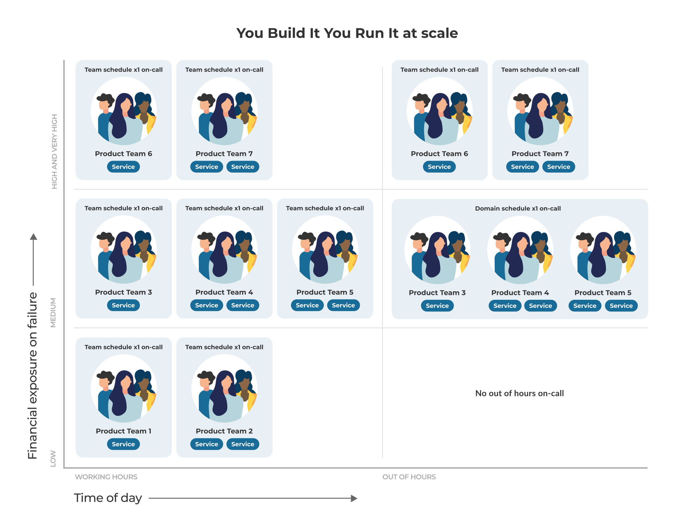
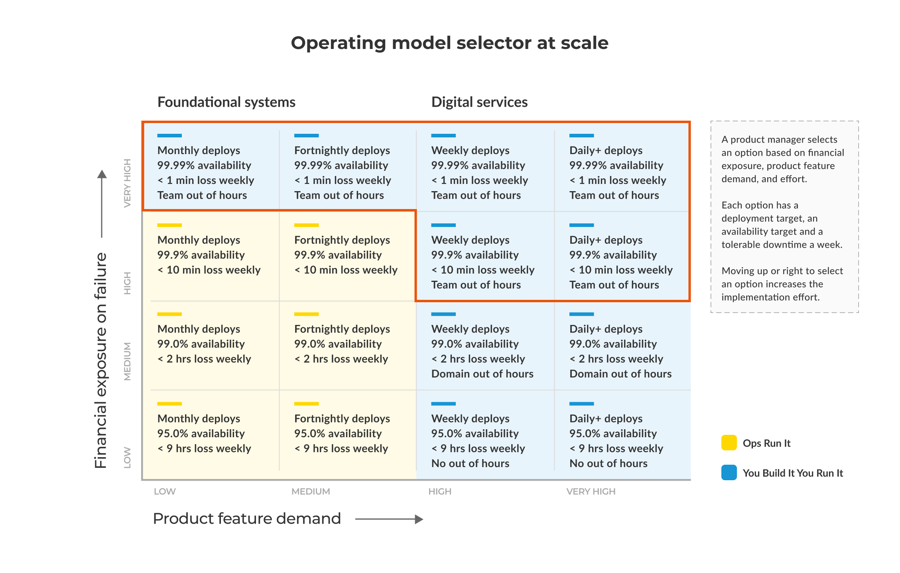

# Scale

These practices explain how to scale You Build It You Run It across a large organisation with many product teams and many digital services. Without these practices, you'll suffer from the [Linear run cost pitfall](https://you-build-it-you-run-it.playbook.ee/pitfalls#linear-run-costs).  

At Equal Experts, we don't believe in prescriptive scaling frameworks. We believe in applying the same holistic principles and practices for deployment throughput, service reliability, and learning culture to 1, 10, or 50 product teams, in a cost-effective way. 

This means:

1. Use the same You Build It You Run It [principles](https://you-build-it-you-run-it.playbook.ee/principles) and [practices](https://you-build-it-you-run-it.playbook.ee/practices) as before.
1. Implement a [digital platform](https://digital-platform.playbook.ee/introduction/what-is-a-digital-platform) to flatten setup costs for product teams and digital services. See the _[Digital Platform Playbook](https://digital-platform.playbook.ee/)_ by Adam Hansrod _et al_. 
1. Introduce additional selection practices for finer-grained operating model choices.

As the number of your product teams and digital services scales up, there can be a temptation to centralise some incident response in a new operations team. It's important to resist this idea, because it's just another form of Ops Run It that will damage delivery throughput, service reliability, and learning culture. 

These practices are linked to our principles of [operating models are insurance for business outcomes](https://you-build-it-you-run-it.playbook.ee/principles#operating-models-are-insurance-for-business-outcomes), and [operating models are selected on financial exposure and product feature demand](https://you-build-it-you-run-it.playbook.ee/principles#operating-models-are-selected-on-financial-exposure-and-product-feature-demand).

## Select out of hours schedule on financial exposure

Ensure that [availability targets are selected on financial exposure](https://you-build-it-you-run-it.playbook.ee/practices/selection#select-an-availability-target-on-financial-exposure), and match an on-call level to an availability target. This achieves a balance between financial exposure, run costs, and remuneration for on-call product teams developers that doesn't weaken operability incentives. 

You Build It You Run It protects business outcomes. It doesn't mean every digital service needs 24x7 on-call support. Not every digital service needs to be 99.99% available, and always on. Some digital services have a low level of financial exposure and don't need out of hours support, some have a medium level of exposure warranting some out of hours support, and some have a high level of exposure that justifies dedicated out of hours support. 

When an availability target is selected for a digital service based on its financial exposure, it is assigned a level of on-call support in addition to its tolerable downtime per week. 

In our [Selection practices](https://you-build-it-you-run-it.playbook.ee/practices/selection), there's a furniture retailer example with a third party COTS ecommerce platform, custom bedroom frontend, and a custom appointments frontend. The financial exposure bands linked to different availability targets can be updated to include levels of on-call:

|Maximum financial exposure in an hour|Availability level|Tolerable unavailability in a week|On-call schedule in working hours|On-call schedule out of hours|
|---|---|---|---|---|
|$7,000|95.0%|8h 24m 0s|Team|None|
|$250,000|99.0%|1h 40m 48s|Team|Domain|
|$800,000|99.9%|0h 10m 5s|Team|Team|

In working hours, a product team always has a team schedule, and is accountable for the reliability of its digital services. Out of hours there could be no schedule, a domain schedule shared between teams, or a team schedule again. 

## Select no out of hours schedule for lower availability targets

Don't do out of hours on-call for your digital services, when you have these desired outcomes:

* Weekly to daily deployments, or more.
* 95.0% availability protection. 
* 9 hours of tolerable unavailability per week.

Reduce on-call standby costs while incentivising product teams to care about operability by promoting working hours ownership and on-call. 

If a production incident happens during working hours, there is an immediate callout to the owning product team, and they respond to the incident based on their [in-incident calculation of financial loss](https://you-build-it-you-run-it.playbook.ee/practices/incident-response#calculate-in-incident-financial-losses). If an incident happens out of hours, the callout is suppressed until the start of the next working day. This incentivises a product team to build operability into a digital service without out of hours support, in order to avoid a production incident spilling over into the next working day.
 
 For the furniture retailer, the appointments frontend has a 95.0% availability target, which matches to no out of hours schedule.
 
 |Software service|Maximum financial exposure in an hour|Availability level|On-call schedule in working hours|On-call schedule out of hours|
 |---|---|---|---|---|
 |appointments|$6,000|95.0%|Team|None|
 
 It's important to protect operability incentives for product teams who are only on-call during working hours. If your organisation has Ops Run It for foundational systems, ensure that digital services cannot be covered out of hours by that operating model. 

## Select domain out of hours schedule for medium availability targets

Share out of hours on-call schedules between sibling product teams for your digital services, when you have these desired outcomes:

* Weekly, daily, or more frequent deployments.
* 99.0% availability protection. 
* 2 hours of tolerable unavailability per week.

Reduce on-call standby costs while incentivising product teams to care about operability, even when they're on-call infrequently. 

A domain schedule is a logical grouping of digital services, with an established affinity. The owning product teams are considered to be siblings. The domain construct needs to minimise on-call cognitive load, simplify knowledge sharing between teams, and focus on business outcomes. We recommend either of the following:

* Product domains grouped by customer journey
* Architectural domains grouped by technology capabilities

We don't recommend geographic domains grouped by region, or technology domains grouped by tool choices. One out of hours schedule for all digital services in a country, or all digital services that use Kotlin produces a mishmash with cross-cutting product boundaries and a high cognitive load. This has a negative impact on the time to diagnose and resolve production incidents.

For the furniture retailer, the bedroom frontend has a 99.0% availability target, which matches to domain out of hours on-call. The owning product team has to identify other digital services in the same product domain, and work with those product teams to establish a shared domain on-call schedule. 

 |Software service|Maximum financial exposure in an hour|Availability level|On-call schedule in working hours|On-call schedule out of hours|
 |---|---|---|---|---|
 |bedroom|$200,000|99.0%|Team|Domain|
 
 Domain schedules balance strong operability incentives with run costs. They aren't perfect, and have their own complications: 
 
 * *Domain on-call funding*. Budget holders for different product teams in the same domain need to choose one of them as the sole budget holder for on-call funding.  
 * *Domain knowledge synchronisation costs*. The cost of sharing knowledge about multiple digital services between multiple product teams can be high, especially if technology choices have been radically different
 * *Domain affinity*. Product teams may disagree on which digital services comprise a domain, or wish to run their own team schedules regardless of availability targets. 
 
 These can be mitigated by ensuring product teams are aware of domains and on-call responsibilities from day one. The sooner a product team is aware they're due to share a domain schedule with another team, the easier that eventual process will be. 

## Select team out of hours on-call for higher availability targets

Do out of hours on-call at scale for your digital services, when you have these desired outcomes:

* Weekly to daily deployments, or more.
* 99.9% or more availability protection. 
* 10 mins or less of tolerable unavailability per week.

Maximise incentives for product teams to care about operability.

This is no different from the standard You Build It You Run It. There should be a small number of digital services that require this on-call level. A high number of product teams with their own team schedules is a weak signal that something is wrong in availability target selection. 

|Domain schedules at John Lewis & Partners|
|---|
|I work on the digital platform team at John Lewis & Partners. We've built a digital platform that allows product teams to do You Build It You Run It as easily as possible. It's part of the reason why [John Lewis & Partners won a digital platform award](https://medium.com/john-lewis-software-engineering/our-award-winning-john-lewis-digital-platform-2d093e03d542)!  In late 2019, we already had 30 digital services, and another 30 were forecast for a year later. We knew having one person on-call per digital service wouldn't be cost effective, especially for digital services that aren't business critical out of hours.  Before development of a new digital service begins, the platform team has a non-technical onboarding conversation with the product manager and architect for the digital service. We have to agree on:<ul><li>Availability target. We use revenue and brand as the primary indicators of business value, and financial exposure.</li><li>On-call level. We select an on-call level based on the availability target. We've implemented no on-call for digital services at 95.0% availability, domain on-call schedules for 99.0% availability, and team on-call schedules at 99.9%.</li><li>Product domain. The business domain that owns the digital service. This forms the basis for a domain on-call schedule at 99.0% availability.</li></ul>Availability target and on-call level aren't set forever. Once a digital service is live, they can vary based on trade patterns, day of the year, and incremental revenue.  A majority of our digital services fall into the bracket for domain schedules. A digital service is covered overnight by a developer from the owning product team, or a sibling team in the same product domain. This incentivises product teams to focus on operability even though they don't have the highest availability target. It spreads product knowledge between teams, and establishes a common language around the domain and upstream/downstream dependencies. Most importantly, it's cost effective, as the number of people on-call does not scale linearly with teams.  We use PagerDuty as our incident management platform. We've automated the creation and grouping of digital services in PagerDuty, based on their on-call level and product domain. If you work on a product team that's part of a domain schedule, all you have to do in PagerDuty is find the entry for the domain, and add in your overnight support. All the administration is done for you.    [Yasin Kothia](https://www.linkedin.com/in/yasinkothia/) Lead Developer EE UK|