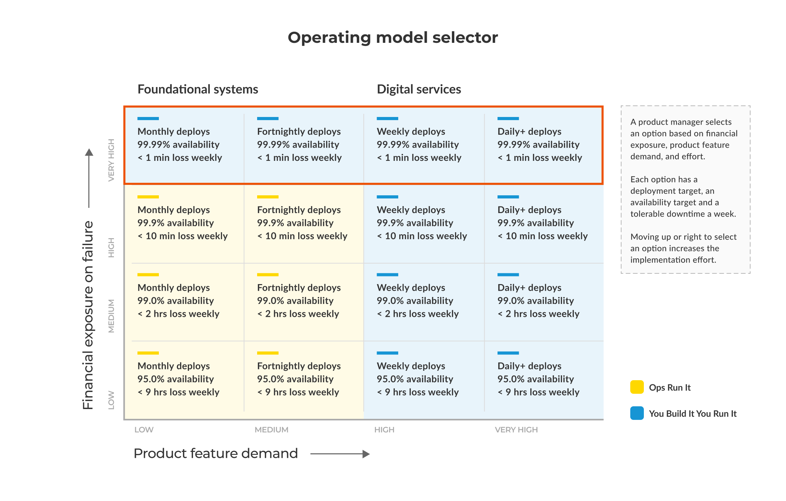
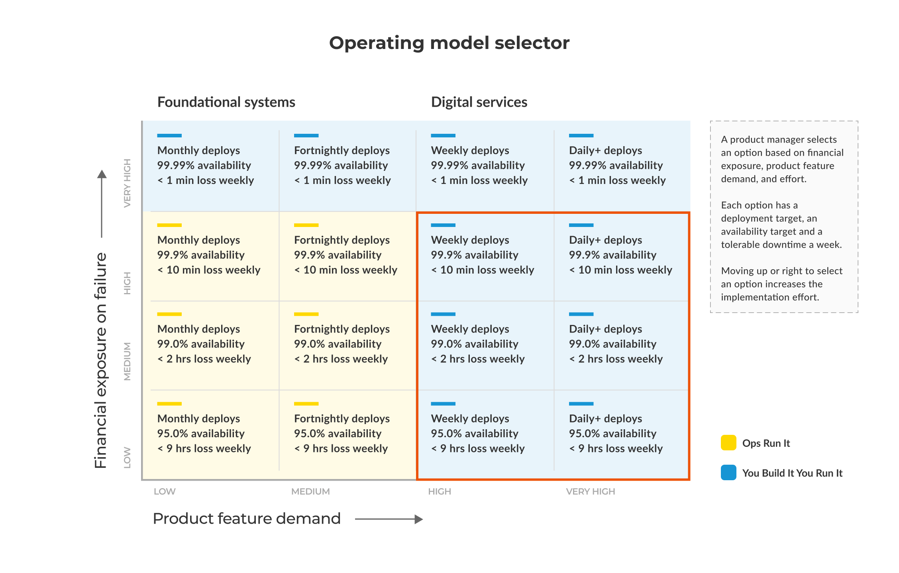
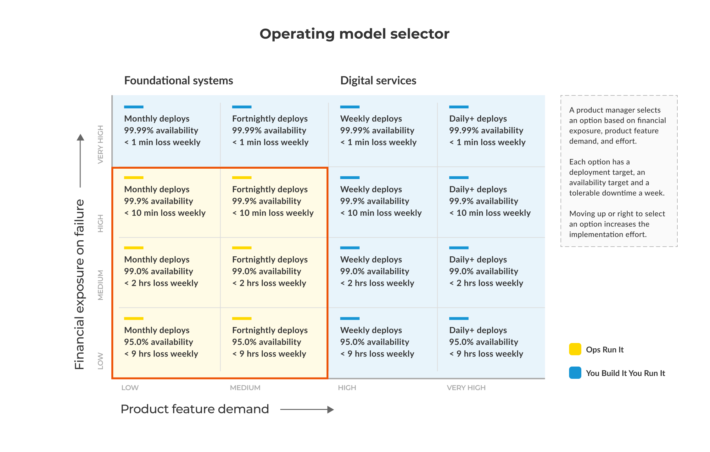

# Selection

These practices refer to the initial selection of an operating model. We believe a hybrid operating model is essential, because we agree with Martin Fowler's statement that a software service is either a [strategic differentiator or a utility](https://martinfowler.com/bliki/UtilityVsStrategicDichotomy.html). We consider a digital service to be a strategic differentiator, and a foundational system to be a utility. 

Our operating model selector is below. Once you understand your failure tolerances and different levels of feature demand, you can map out which operating model is right for you. 

**Figure 2: operating model selector**

To help understand which operating model is best for your software service, follow these selection practices. 

**Figure 3: selection practices**

These practices are linked to our principles of operating models are [insurance for business outcomes](https://you-build-it-you-run-it.playbook.ee/principles#operating-models-are-insurance-for-business-outcomes), and [operating models are selected on financial exposure and product feature demand](https://you-build-it-you-run-it.playbook.ee/principles#operating-models-are-selected-on-financial-exposure-and-product-feature-demand).

## Select an availability target on financial exposure

Financial exposure is the maximum revenue loss and costs a software service can incur upon failure. An availability target is a desired level of availability, and expressed as a number of nines. An additional nine of availability means more implementation effort. 

Calculate an availability target for a software service via this process: 

1. *Estimate financial exposure bands for availability levels*. This is a two-step process for all software services:
    1. Estimate high, medium, and low exposure bands on organisation-wide financial forecasts, and historic incident losses. We ask "what data do we have for how much money we could lose in an hour?"
    1. Assign the availability levels 99.9%, 99.0%, and 95.0% to the high, medium, and low exposure bands. 99.99% can be used if your organisation has a genuine need for extreme reliability. We ask "for this exposure band, how much unavailability are we actually willing to tolerate - and how much of the exposure are we able to accept as a loss?" 
1. *Calculate the availability target, by estimating financial exposure*. This is a multi-step process:
    1. A product manager estimates their service exposure based on their own financial forecasting. We ask "what's the maximum revenue loss and costs we'll incur if this software service is unavailable for an hour?"
    1. Automatically link a service exposure to the highest exposure band it fits into. We ask "what's the financial exposure band that covers this service exposure?"
    1. Automatically link a service exposure onto the availability target for a particular exposure band. We ask "what's the availability target for the financial exposure band that covers this service exposure?"
1. *Periodically reflect on financial exposure and availability*. This is for all software services. Compare recent incident losses with our availability target calculator, on at least a quarterly basis. We ask "do we have any new financial data that warrants an update to our financial exposure bands, our availability levels, or the availability targets for our software services?"

Assume a furniture retailer has a self-hosted COTS ecommerce platform, a custom bedroom frontend, and a custom appointments frontend. Financial losses from prior incidents for multiple software services are examined. Their different traffic profiles and different incident losses allow for an arbitrary grouping into financial exposure bands of $7K, $100K, and $800K loss in one hour.  

|Maximum financial exposure in an hour|
|---|
|$7,000|
|$250,000|
|$800,000|

**Table 1 - financial exposure bands**

The furniture retailer examines its appetite for unavailability at its different exposure bands, and commits to 95.0%, 99.0%, and 99.9% as its availability levels. For example, for the $800K exposure band 99.9% of a week is 167 hours 49 mins 55 secs, so the tolerable unavailability in one week of 0.01% is 10 mins 5 secs.

|Maximum financial exposure in an hour|Availability level|Tolerable unavailability in a week|
|---|---|---|
|$7,000|95.0%|8h 24m 0s|
|$250,000|99.0%|1h 40m 48s|
|$800,000|99.9%|0h 10m 5s|

**Table 2 - financial exposure bands with availability targets**

Product managers then use their service forecasts to estimate a maximum financial exposure of $810K in an hour for the ecommerce platform, plus $6K and $200K for appointments and bedroom frontends. 

Each software service is matched to an availability target via its service exposure. For example, the bedroom service is assigned a 99.5% availability target, as its service exposure of $200K in an hour falls under the 99.5% exposure band of $250K. 

|Software service|Maximum financial exposure in an hour|Availability target|
|---|---|---|
|ecommerce-platform|$810,000|99.9%|
|appointments|$6,000|95.0%|
|bedroom|$200,000|99.0%|

**Table 3 - software services with availability targets**

The furniture retailer values its financial exposure bands once a quarter. Financial losses from prior incidents are reviewed, and if necessary the financial exposure bands are recalculated. This ensures the risk of financial exposure is revalidated as the business changes.

Indirect financial losses caused by reputational damage also need to be considered. In the private sector this includes customer credits and subscription cancellations. In the public sector, it's employee time spent on manual, paper-based fallbacks. Reputational damage needs to be tied into core business metrics such as customer lifetime value and customer satisfaction, and it can be tracked using [Net Promoter Score](https://en.wikipedia.org/wiki/Net_promoter_score).

## Select a higher availability target for peak exposure

Calculate a different availability target for a software service during a peak business event, such as Black Friday. This is a repeat of [selecting an availability target on financial exposure](https://you-build-it-you-run-it.playbook.ee/practices/selection#select-an-availability-target-on-financial-exposure).

This involves a product manager calculating peak and non-peak financial exposures for their software service, based on their financial forecasting. The availability target for the software service is then upgraded just before the peak business event, and downgraded just after the peak business event. 

This is an effective cost optimisation, that doesn't affect operability incentives. It replaces the notion of [eyes on glass monitoring and peak support in Ops Run It](https://you-build-it-you-run-it.playbook.ee/what-is-ops-run-it/service-reliability#availability-protection-in-ops-run-it). It ensures a balance between service reliability and run cost for You Build It You Run It. 

## Select deployment target on feature demand

Product feature demand is customer demand for new product features.

A deployment target is a required level of deployment frequency. An increase in frequency means more implementation effort. 

Calculate a deployment target using this process:

1. *Estimate feature demand bands for all software services*. We estimate product feature demand based on organisation-wide financial forecasts, customer research, and live analytics. We ask "how much demand is there in a month for product features?"
1. *Match deployment frequency levels to feature demand bands*. We match a feature demand band with a deployment frequency. We ask "for this feature demand band, how often do we need to deploy product features to satisfy demand?"
1. *Estimate feature demand for a software service*. A product manager estimates their feature demand based on customer research and analytics. We ask "what's the feature demand we'll see from customers, for this software service?"
1. *Calculate the feature demand band for a software service*. We automatically link service demand with the feature demand band it fits into. We ask "which of our feature demand bands covers this service demand?"
1. *Calculate the deployment target for a software service*. We automatically link service demand onto the deployment target for a particular feature demand band. We ask "what's the deployment target for the feature demand band that covers this service demand?"
1. *Periodically reflect on feature demand bands and deployment targets*. We compare recent analytics with our deployment target calculator, on at least a quarterly basis. We ask "do we have any new data that suggests an update to our feature demand bands, or our deployment frequency levels?" 

The furniture retailer defines relative feature demand bands, from low to very high. The deployment frequency of one software service relative to another is recognised as the most important property. Relative feature bands allow the unique characteristics of different furniture domains to be taken into account.

|Maximum feature demand in a month|
|---|
|Low|
|Medium|
|High|
|Very high|

**Table 4 - feature bands**

The furniture retailer identifies monthly, fortnightly, weekly, and daily deployments as its deployment frequency levels, and ties them to feature demand bands. 

|Maximum feature demand in a month|Deployment frequency|
|---|---|
|Low|Monthly|
|Medium|Fortnightly|
|High|Weekly|
|Very high|Daily+|

**Table 5 - feature bands with deployment frequency levels**

Product managers estimate low demand for the ecommerce platform, high demand for the appointments frontend, and very high demand for the bedroom frontend. 

Each software service is matched to a deployment target by its service demand. For example, the bedroom service is assigned to daily deployments, as its service demand is believed to be very high. 

|Software service|Maximum feature demand in a month|Deployment target|
|---|---|---|
|ecommerce-platform|Low|Monthly|
|appointments|High|Weekly|
|bedroom|Very high|Daily+|

**Table 6 - software services with deployment targets**

## Select You Build It You Run It for 99.99% availability

Adopt You Build It You Run It for any foundational system or digital service, when you require extreme reliability:

* 99.99% availability protection.
* 1 minute of tolerable unavailability per week.

It's rare for our customers to truly require 99.99% availability. The engineering effort involved is enormous.

**Figure 4: operating model selector for 99.99% availability**

## Select You Build It You Run It for digital services

Adopt You Build It You Run It for your digital services, when you have these desired outcomes:

* Weekly, daily, or more frequent deployments.
* 95.0% to 99.9% availability protection. 
* 9 hours to 10 minutes of tolerable unavailability per week.

**Figure 5: operating model selector for digital services**

For the furniture retailer, the appointments and bedroom frontends match with You Build It You Run It.

|Software service|Availability target|Deployment target|Operating model|
|---|---|---|---|
|appointments|95.0%|Weekly|You Build It You Run It|
|bedroom|99.0%|Daily+|You Build It You Run It|

**Table 8: digital services with You Build It You Run It**

In the private sector, it's possible to have digital services with a low level of revenue exposure, and high feature demand. For example, a medical publishing company with a per-institution subscription model could have customers clamouring for new features, but a website failure would not incur direct revenue loss as customer dissatisfaction is not linked to subscription renewal. Operational costs and indirect revenue loss would need to be factored into the availability target calculation.

We'd urge caution if you believe a low availability target and a low deployment target apply to your digital services. Low financial exposure on failure and low product feature demand could signify you're building the wrong thing for your customers. 

## Select Ops Run It for foundational systems

Select Ops Run It for your self-hosted COTS applications and custom integrations, when your desired outcomes are:

* Monthly to fortnightly deployments.
* 95.0% to 99.0% availability protection.
* 9 hours to 10 minutes of tolerable unavailability per week.

Foundational systems usually require infrequent code changes after launch. 

**Figure 6: operating model selector for foundational systems**

For the furniture retailer, the ecommerce-platform COTS application matches with Ops Run It at a higher availability target. 

|Software service|Availability target|Deployment target|Operating model|
|---|---|---|---|
|ecommerce-platform|99.9%|Monthly|Ops Run It|

**Table 9: foundational systems with Ops Run It**

|Traffic lights You Build It You Run It in retail|
|---|
|I worked at a large retailer in Australia, where we gradually moved teams and their services from Ops Run It to You Build It You Run It. The transition can be hard, and to ensure a pragmatic approach we introduced a traffic light system. We used it to help us decide if a service should remain in Ops Run It, or be moved to You Build It You Run It.  We tracked outcomes for each service, including its availability target and deployment frequency target, to determine where they were on the traffic lights.<ul><li>Red was for a fortnightly deployment target, or lower and meant Ops Run It.</li><li>Green was for a weekly deployment target or higher, and meant You Build It You Run It.</li><li>Amber was for a deployment target that lay in between. The service availability target was used as a tiebreaker. We had previously concluded 99.9% was not possible to achieve under Ops Run It, as it only permitted 44 minutes of downtime in a month. So a target of 99.9% or higher meant You Build It You Run It, and a target of 99.0% or lower meant Ops Run It.</li></ul>The traffic light system meant we could look at services holistically. We could build a clear picture of how many services were in Ops Run It, how many were ready to transition into You Run It, and how many required more careful thought. It allowed us to clearly see across the digital estate where we needed to focus our efforts, on changing the operational model to gain the biggest benefit to the organisation.    [Tony Nguyen](https://www.linkedin.com/in/tonynguyenoz/) Director EE Australia|