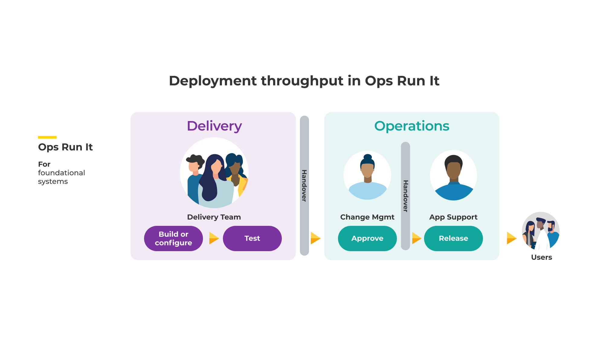

# Deployment throughput in Ops Run It

**Figure 6: Ops Run It - deployment throughput**

Ops Run It teams vary between organisations. Your application support team could be called application operations. Your change management and application support teams could be augmented by a service introduction team, who assess operational readiness prior to live launch. 

A delivery team performs automated functional testing and exploratory testing. When they want a production deployment to happen, they need to follow a service management process owned by the operations teams:

1. Delivery team requests change. The delivery team adds a ticket into the change management queue, in a workflow system such as [ServiceNow](https://www.servicenow.com/). In ITIL v3, this is classified as a normal change request. 
1. Change management team reviews change. When the change management team picks up the ticket, they approve or reject the change request in a Change Advisory Board (CAB) meeting, based on their knowledge of other in-flight changes.
1. Change management team requests deployment. If the change is approved, the change management team schedules a ticket into the application support queue.  
1. Application support team performs deployment. When the application support team picks up the ticket, they use a tool such as [Jenkins](https://www.jenkins.io/) or [GitLab CI](https://docs.gitlab.com/ee/ci/) to orchestrate the deployment. A deployment can happen out of hours, if downtime is required. 
1. Delivery team performs post-deployment validation. The delivery team does some post-deployment smoke testing, before the application support team accepts ownership of the new live service.

We've occasionally seen a deployment throughput variant of Ops Run It, in which delivery teams can perform some classes of deployments themselves. It requires a high degree of automated functional testing, and a fully automated deployment pipeline including change management approvals and production deployments. Change requests are pre-approved for small, regular changes. Large, irregular changes still require a CAB meeting and deployment by the application support team. In ITIL v3, this is the difference between standard and normal change requests.

This variant depends on a high trust environment, with a strong culture of collaboration. It's heavily dependent on senior leaders in Delivery and Operations functions sharing a sense of urgency, and teams working hard to recognise their similarities rather than their differences. We've only seen this work in a few mid-sized organisations, and we've not seen it scale to many teams.
 
## Deployment throughput costs in Ops Run It

Ops Run It deployment throughput costs are listed in Table 2. We've attributed to each an estimate of how much they usually contribute to the total cost of ownership. Per deployment costs are charged to operational expenditure (opex) rather than capital expenditure (capex), as the operations teams are centralised and distinct from any particular service.

|Cost Type|Frequency|Description|Impact|TCO %|
|---|---|---|---|---|
|Setup cost|One-off|Launch costs incurred in<ul><li>Change management team time for setup</li><li>Application support team time for deployment setup</li></ul>|Capex cost|Medium|
|Opportunity cost|Per feature|Can be measured as the cost of delay between product feature readiness and its launch. Potential revenue loss, missed customer opportunities due to<ul><li>Delay waiting for CAB meeting</li><li>Delay waiting for production deployment and launch|Lost revenue, capex or opex cost increase</li></ul>|High|
|Run cost|Per deployment|Deployment costs incurred in<ul><li>Time to produce change documentation for change management team</li><li>Time to product handover documentation for application support team</li><li>Change management team time for CAB</li><li>Change reporting licenses</li><li>Time for performing deployments, and rolling back failed deployments</li></ul>|Opex cost|Medium to high|

**Table 2: Ops Run It - deployment throughput costs**

**Figure 7: Ops Run It - deployment throughput costs**

