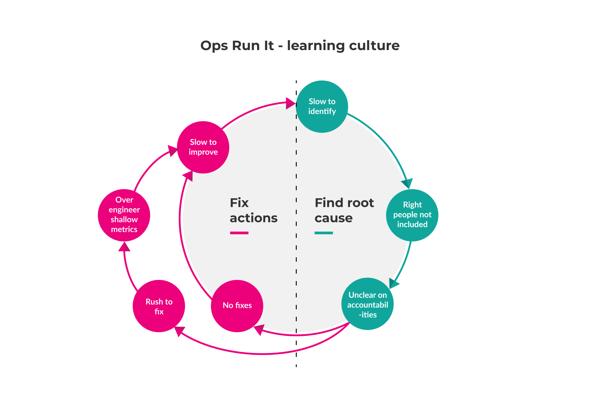

# Drawbacks of Ops Run It

Ops Run It has a lot of drawbacks for digital services. They're systemic, and not the fault of any delivery or operations team. They're generally related to the [hard divide between siloed delivery and operations teams](./). Countermeasures are sometimes available, albeit with their own costs and complexity.

Ops Run It creates a [diffusion of responsibility](https://en.wikipedia.org/wiki/Diffusion\_of\_responsibility). Product managers are responsible for launching products they don't support, and are incentivised to prioritise product features over operational features. Delivery teams are responsible for building services they don't support, and are incentivised to maximise deployments. Operations teams are responsible for supporting services they don't build, and are incentivised to minimise deployments. This results in a slow time to market, reliability problems, and/or limited learning opportunities.

Due to these drawbacks, Ops Run It can't sustain weekly or more frequent deployments. There's an underinvestment in operability, and a burden on the operations teams grows as the number of delivery teams increases. Eventually, they become a significant organisational bottleneck, through no fault of their own.

## Deployment throughput

* _Slow change approvals_. Change requests take hours, days, or weeks to be signed off. In fact, Dr. Forsgren _et al_ demonstrated in [_Accelerate_](https://www.amazon.co.uk/Accelerate-Software-Performing-Technology-Organizations/dp/1942788339) that not having a change approval process leads to more positive outcomes than an ITIL change process.
  * A change management team can be slow to pick up a change request, if they have one queue for all incoming work and/or it's an ITIL normal change request with a 3-5 day response time.
  * A change management team can be slow to approve a change request, if a CAB meeting requires a business justification, rollback plan, etc. from the delivery team.
  * Slow deployments. Deployments take hours or days to complete successfully.
  * An application support team can be slow to take on a deployment, if they have one queue for all incoming work and their own operational work to prioritise.
  * An application support team can have to contend with a semi-automated deployment process, intermittent failures, and ambiguous documentation from delivery teams.
  * An application support team can be unable to create an automated deployment pipeline, if ownership of the deployment process is shared with delivery teams.
* _Zero focus on outcomes_. Digital services are created as outputs with no regard for customer outcomes. Delivery teams lack the access to live traffic data necessary to form product hypotheses.
* _High knowledge synchronisation costs_. Knowledge synchronisation takes hours or days between operations and delivery teams. An application support team can require knowledge transfer meetings and/or runbook updates for every deployment.
* _Scheduling conflicts_. Deployments are rescheduled on short notice. An application support team suffers from management escalations and fluctuating priorities, as delivery team stakeholders seek faster results for themselves.
* _Contractual deployment charges_. Traditional supplier contracts discourage an increase in deployments. An outsourced application support team can charge a lower rate for two or three deployments per month, a higher rate for rollbacks, and a much higher rate for more frequent deployments.

These drawbacks add up to high opportunity costs, with potential revenue lost due to the long lead times to launch new product features. The obvious countermeasure is to create a fully automated deployment pipeline, to reduce errors and speed up the deployment process. We'd strongly recommend a deployment pipeline, and caution that it can't tackle most of these drawbacks alone. For example, it can't eliminate the delays incurred on each handoff between teams.

## Service reliability

We usually see an overwhelmed application support team. They have to support complex, fragile, poorly-documented digital services, produce miraculous fixes to tough problems, and cope with a high number of L2 callouts.

### Availability protection

* _Uninformative telemetry_. Alerts, logs, metrics, and dashboards are based on low-level events, which cannot illuminate operating conditions. An operations team can't change monitorable events without digital service changes prioritised by a product manager.
* _Poor documentation_. Architecture diagrams, alert threshold guides, configuration settings, and runbooks sourced from delivery teams are either outdated or do not exist.
* _On-call dissatisfaction_. Delivery team developers on best efforts on-call out of hours are not compensated for the inconvenience, and disruption to their lives outside of work.
* _Fragile architecture_. Services have a large blast radius, an inability to gracefully degrade on failure, and an exposure to severe outages. An operations team can't limit blast radius without digital service changes prioritised by a product manager.

### Availability restoration

* _Slow alert acknowledgement_. An alert takes up to 20 minutes to be acknowledged. The on-call operations bridge analyst needs to classify the alert, look up the correct application support analyst in the on-call schedule, successfully contact that analyst, and handover the alert for acknowledgement.
* _Slow incident resolution_. An incident takes hours or days to be resolved:
  * An outsourced application support team can be slow to pick up an L2 incident, if their contractual response time is hours or days.
  * An application support team can be slow to pick up an L2 incident, if they are dealing with planned work or another incident.
  * An application support analyst can bounce an L2 incident back to the operations bridge team, if they need more details or don't believe they are the best-placed responder.
  * An application support analyst can be unable to implement a workaround for an L2 incident, if they lack the permissions to modify service configuration.
  * A delivery team can no longer exist to pick up an L3 incident, if they were disbanded and moved onto new project work after their service was launched.
  * A delivery team can be slow to pick up an L3 incident in office hours, if they are already dealing with planned product features for a deadline.
  * A delivery team developer can be slow to pick up an L3 incident out of hours, if their on-call is best efforts and there is no compensation for on-call inconveniences.
  * A delivery team developer can bounce an L3 incident back to the application support team, if they need more details or don't believe they are the best-placed responder.
  * A delivery team developer can be slow to understand an L3 incident, if they lack prior knowledge of abnormal operating conditions for their digital services.
  * A delivery team developer and application support analyst can find it hard to collaborate on an L3 incident, if their ways of working and tools are different.
  * A delivery team developer can be unable to access telemetry data for an L3 incident, if they lack the permissions to use live telemetry tools.
  * An incident manager, DBA, or network admin can be slow to pick up an L2 or L3 incident, if they are dealing with planned work or another incident.
* _High volume of L2 callouts_. Incidents can require more L2 escalations than expected. Failure modes are rarely straightforward or repeatable. They may require diagnosis by the application support team, to confirm if a resolution by the operations bridge team is possible. The operations bridge team can only have scripts and runbooks for anticipated failure scenarios.

We've seen these reliability drawbacks add up to substantial financial losses incurred during production incidents, particularly during key trading periods. The most common countermeasures are:

* _L1 delivery team for key periods_. Delivery teams can provide [hypercare and peak support](service-reliability.md) during service launch and/or busy trading periods, to flatten the time to resolve any incidents. This incurs a capex run cost. It requires negotiation between delivery teams and operations teams in advance, and it can be abruptly cancelled if funding runs out.
* _L1.5 application support team_. Digital service alerts can be routed to the application support team as well as the operations bridge team. This speeds up alert acknowledgement and incident resolution. It inevitably increases the workload on the application support team, and calls into question the purpose of the operations bridge team for digital services.

## Learning culture

These drawbacks are specific to root cause analysis, as it is the most common means of collaborative learning in Ops Run It.

* _Low quality insights_. Root cause analysis sessions produce a few insights of limited value.
  * Attendees lack sufficient time pre-session and in-session to consider events and their consequences during an incident.
  * Attendees are implicitly steered towards identifying a single human or technical error as the sole cause of failure.
  * Attendees can be publicly blamed for causing an incident, if human error is believed to be the sole cause of failure.
  * Attendees can withhold information about their participation in incident response, if they fear blame attribution and ramifications for acknowledging mistakes.
* _Poor insight dissemination_. Problem managers lack the incentives and/or organisational contacts to share a root cause analysis across an organisation. Delivery teams may be entirely unaware when their digital services are involved in production incidents. Knowledge is trapped in silos.
* _Slow time to improve_. A fix action can take days, weeks, or months to be completed. We've seen fix actions stuck in support backlogs for long periods. We've even seen the same action appear multiple times in the same backlog, because multiple incidents for the same digital service have yielded the same unimplemented action.
  * An application support team can be slow to pick up an action, if they are dealing with planned work or another incident.
  * An application support analyst can bounce an action back to the problem manager, if they need more details or don't believe they are the best-placed responder.
  * A delivery team can no longer exist to implement an action, if they were disbanded and moved onto new project work after their service was launched.
  * A delivery team can be slow to pick up an action, if they are already dealing with planned product features for a deadline.
  * A delivery team developer can bounce an action back to the problem manager, if they need more details or don't believe they are the best-placed responder.

Our customers are often aware of the high coordination costs of root cause analysis sessions, and long lead times for fix actions. We usually see these countermeasures:

* _Root cause analysis for major incidents only_. Root cause analysis sessions are only held if an incident is deemed to be high priority. This limits learning opportunities for operations and delivery teams, and ensures weak signals of latent faults within live digital services go unseen.
* _Fix delivery team_. This is sometimes known as a small works team. A fix delivery team implements code fixes for backlog actions, based on analysis from the application support team. This is no guarantee of faster lead times, as the fix delivery team does not own any digital services itself. The affected delivery teams can take days or weeks to accept proposed code changes, and incorporate them into their own deliverables.

We believe these drawbacks are tied to the Ops Run It predisposition of rush to fix. When a production incident happens, identifying fix actions is prioritised over in-depth investigation. Operations and delivery teams have a fixed mindset in which flaws and mistakes are shameful, and concealed from others. This creates a vicious circle, in which root cause analysis sessions are completed as quickly as possible, nobody has the time to acquire meaningful knowledge about their digital services, and the production incidents continue.

