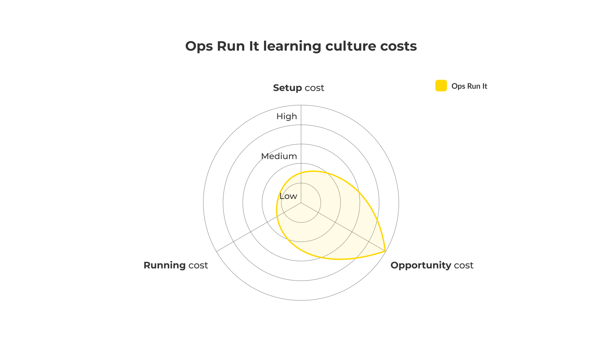

# Reactive culture in Ops Run It

**Figure 10: Ops Run It - reactive culture**

We refer to the Ops Run It reactive culture as predisposed to ‘rush to fix’. When there is an incident of consequence, such as a failed deployment or a loss of service availability, the priority is to fix the underlying problem and return to the prior state. In ITIL v3, this is considered part of problem management, and overseen by a problem manager. 

## Find the root cause

After an incident, a problem manager schedules a root cause analysis session within days or weeks. The purpose is to find the root cause of the failure, and implement any fix actions afterwards. 

Attendees in a root cause analysis session include the application support analysts and incident managers that participated in incident response. The problem manager facilitating the session can invite delivery team developers if the incident was escalated to an L3 callout. 

The session format is:

* Share incident observations and service telemetry data.
* Capture a financial impact assessment, including revenue losses and costs incurred. 
* Document a single timeline of events from incident start to incident finish.
* Agree on a single, perceived human or technical error that caused the failure.
* Establish a series of fix actions with the aim of permanently fixing the problem.

The problem manager summarises the session in a root cause analysis document. This is shared with session attendees, and depending on the circumstances perhaps the delivery and operations teams as well. 

## Implement fix actions

After the session, the problem manager records the root cause as a problem in the company workflow system, and the recommended fix actions. Documentation fixes are handed over to the application support team, such as amending training procedures or updating a service runbook with a workaround for the problem. Code and configuration fixes are handed over to the delivery team(s). 
 
## Reactive culture costs in Ops Run It

Ops Run It reactive culture costs are listed in the table below. They’re incurred each time someone has an idea on how to improve a digital service.

|Cost Type|Frequency|Description|Impact|TCO %|
|---|---|---|---|---|
|Setup cost|One-off|Launch costs incurred in<ul><li>Application support team training for root cause analysis</li></ul>|Opex cost|Low to medium|
|Insight opportunity cost|Per insight|Can be measured as the cost of delay between generating an insight and implementing the related actions. Potential revenue lost and/or costs incurred due to service unavailability, missed opportunities with customers, and delays in feature development|Lost revenue, capex or reactive cost|High|
|Insight implementation cost|Per insight|Costs incurred in implementing an action linked to an insight. Could include adding infrastructure capacity, code fixes, documentation, etc.|Capex or opex cost|Low to medium|
**Table 4: Ops Run It - reactive culture costs**

**Figure 11: Ops Run It - reactive culture costs**

