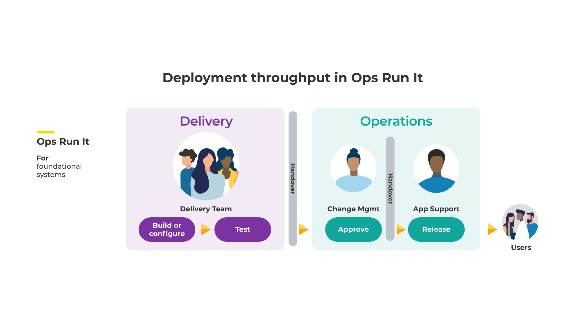
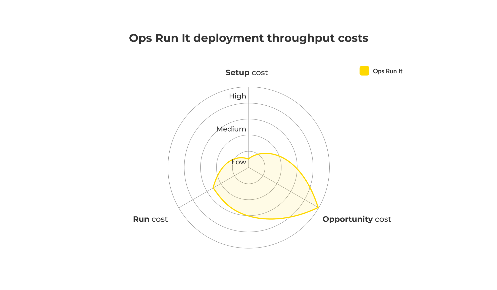

# Service reliability in Ops Run It

**Figure 8: Ops Run It - Service reliability**

Service reliability involves a multi-level hierarchy of teams - an L1 operations bridge team, an L2 application support team, L3 delivery teams. There are also operational enablers who can be called upon for assistance, such as incident management and DBAs. This setup varies between different organisations: 

* Your customer self-service capabilities could be classified as L0. 
* Your help desk team could be called customer services.
* Your operations bridge team could be called the operations centre. 
* Your application support team could be called application operations.
* Your help desk and operations teams could be a single L1 team.
* Your operations bridge and application support teams could be a single L2 team.

The L1 help desk team receives customer complaints about service availability. They attempt to use documentation to resolve high volume, straightforward issues. 

The operations bridge and application support teams offer 24/7 production support. They are responsible for day-to-day work in availability protection and availability restoration. They track their costs centrally, and make them visible to senior leaders. They report into the senior manager in the Operations function, who is accountable for all aspects of reliability.

Application support analysts can modify the below facets of a digital service: 

* Alert definitions
* Configuration
* Data
* Deployments
* Manual or automated infrastructure 
* Monitoring dashboards

For governance, the senior operations manager is accountable for all aspects of digital service reliability. The operations bridge and application support teams share responsibility for availability protection, and availability restoration.

## Availability protection in Ops Run It

The operations bridge team proactively monitors service telemetry for abnormalities. This is sometimes known as ‘eyes on glass’. They observe service health checks, logs, and metrics plumbed into different dashboards, in telemetry tools such as [AppDynamics](https://www.appdynamics.com/) or [New Relic](https://newrelic.com/). Their  dashboards are dependent on monitorable events, which are pre-defined by delivery teams within the services. Changes to the monitorable events are rare. 

The application support team proactively updates digital services and their runtime environments, using tools like [Red Hat Satellite](https://www.redhat.com/en/technologies/management/satellite). They add infrastructure capacity, make configuration changes, apply data fixes, and update dashboards, to reduce drift and prevent abnormal conditions. This is labour intensive toil, and the workload can increase dramatically for a peak business event. 

Delivery teams are usually oblivious to the heroics performed by operations teams in availability protection. There are some scenarios in which they can be temporarily promoted to L1 availability protection, alongside operations teams:

* *Hypercare*. Support for a few weeks after service launch. Also known as a warranty period.
* *Peak support*. Support for a peak business event, such as Black Friday. Also known as enhanced support. 

## Availability restoration in Ops Run It

When availability for a service falls below its availability target, an incident is declared and efforts are made to restore availability. In ITIL v3 this is overseen by an incident manager. The vast majority of incidents are expected to be resolved by the L1 help desk and operations bridge teams, with a minority reaching L2 application support. Very few are expected to reach the L3 delivery teams.

The operations bridge team receives service alerts that warn of availability errors. They raise a ticket in the incident tracking system and record all the service telemetry data at hand. They can try to restore availability with restart scripts. If unsuccessful, they reassign the ticket and escalate to the application support team. 

The application support team receives notifications of service unavailability from their ticket queue. They diagnose the causes of unavailability via heuristics, expertise, and service telemetry data. They attempt to restore availability via additional infrastructure, data fixes, config changes, rollbacks, and telemetry changes. If the service remains unavailable, they locate the delivery team that owns the service and escalate the incident to them. 

Delivery teams receive notifications of service unavailability from the application support team, when availability cannot be restored by operations teams alone. The notification is often informal, and urgent. One or more delivery team developers collaborate with the application support team to clarify the causes of service unavailability, and restore the service via whatever means necessary. This can include deployments of emergency code changes. 

## Service reliability costs in Ops Run It

Ops Run It reliability costs are listed in the below table. We’re assuming on-call standby costs and on-call callout are both present, although organisations can have very different remuneration models.

|Cost Type|Frequency|Description|Impact|TCO %|
|---|---|---|---|---|
|Setup cost|One-off|Launch costs incurred in<ul><li>License purchases</li><li>Application support team time for telemetry install</li><li>Application support team time for schedule agreement</li></ul>|Capex cost|Low to medium|
|Transition cost|One-off|Launch costs incurred in<ul><li>Application support team time for handover plan agreement</li><li>Delivery team time for implementation operational acceptance criteria</li></ul>|Capex cost|High|
|Running cost|Ongoing|Regular costs incurred in application support team time for<ul><li>Applying data fixes</li><li>Making configuration changes</li><li>>Adding infrastructure capacity</li><li>Performing rollbacks</li><li>Updating telemetry tools</li><li>On-call standby out of hours</li></ul>|Opex cost|Low to medium|
|Incident cost|Per incident|Incident response costs incurred in application support team time for<ul><li>Applying data fixes</li><li>Making configuration changes</li><li>Adding infrastructure capacity</li><li>Performing rollbacks</li><li>Updating telemetry tools</li><li>On-call callout out of hours</li></ul>|Opex cost|Medium to high|
|Opportunity cost|Per incident|Can be measured as the cost of delay between incident start and finish. Caused by service unavailability, missed opportunities with customers, and delays in further feature development|Revenue loss and costs incurred|Medium to high|

**Table 3: Ops Run It - service reliability costs**

In Ops Run It, we often observe operations managers under pressure to reduce their opex spend. The common countermeasures are:

* *Outsource L1 and L2 support*. Reduce on-call standby rates, on-call callout rates, and operations team payroll costs by outsourcing the service desk, operations bridge, and/or application support teams to a third party managed service. The contract is likely to be multi-year, and could include service credits linked to an incident count threshold.
* *Do not pay for L3 support*. Avoid on-call standby rates and on-call callout rates by ensuring delivery team developers are not paid for L3 best efforts on-call. There can be unofficial compensation as informal time off in lieu.

These countermeasures have trade-offs, and they contribute to [Ops Run It drawbacks](https://you-build-it-you-run-it-playbooks.ee/what-is-ops-run-it/drawbacks) as well.  

**Figure 9: Ops Run It - service reliability costs**

