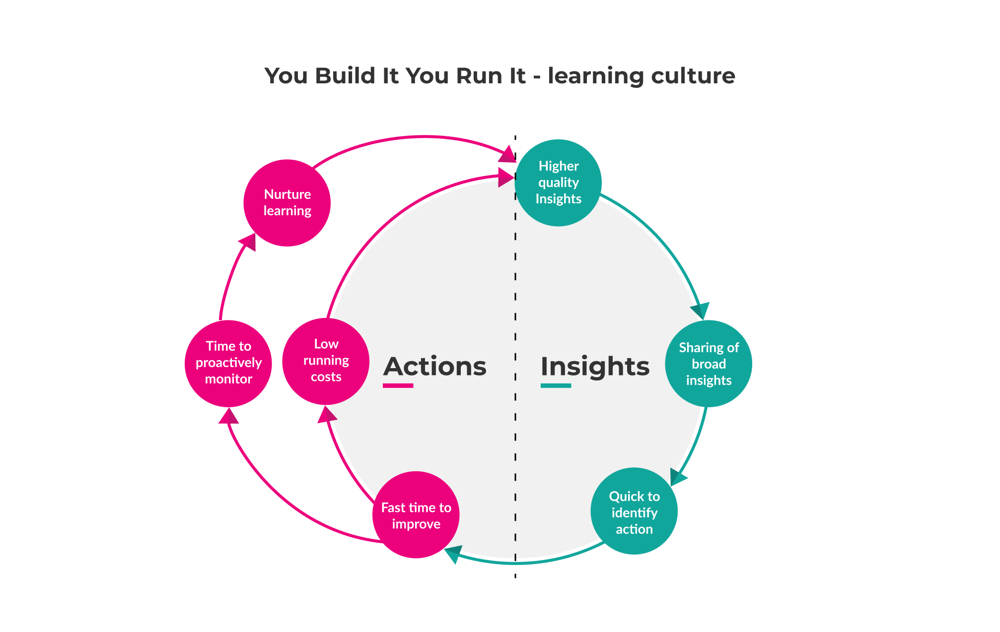

# Benefits of You Build It You Run It

You Build It You Run It benefits come from team empowerment, and clear operability incentives. There’s no hard divide between siloed delivery and operations teams. There are no time-consuming handoffs, nor any diffusion of responsibility. A product manager is incentivised to constantly balance the prioritisation of operational features alongside product features, because they’re accountable for service reliability. A product team is incentivised to build operability into their digital services, because they’re on-call out of hours for their own work.

## Deployment throughput

* *Fast change approvals*. Frequent, low risk deployments have pre-approved standard change requests, which involve no change management team time. Infrequent, high risk deployments may still require a CAB meeting, and incur the same [change approval delays as Ops Run It](https://you-build-it-you-run-it.playbooks.ee/what-is-ops-run-it/drawbacks).
* *Fast deployments*. Deployments take minutes to complete successfully. An on-call product team can perform a deployment in working hours with no handoffs, and they can fully automate their own deployment pipeline to minimise deployment failures.  
* *Focus on outcomes*. Digital services are created to deliver customer outcomes. Live traffic data is used to create product hypotheses, which are tested against customer feedback.
* *Low knowledge synchronisation costs*. An on-call product team can store most of its service documentation within the code itself, and use its own runbooks to store acquired operational knowledge. Knowledge synchronisation takes minutes between team members, as they already work within the digital service on a daily basis.
* *No scheduling conflicts*. An on-call product team can reschedule its deployments as and when necessary, without any conflicting workload priorities. 
* *Low running costs*. The costs of performing deployments and rolling back failed deployments can be extremely low. An on-call product team has sole responsibility for their automated deployment pipeline, and can devote as much time to it as necessary.
* *Proactive change management*. Change managers can become involved in digital service delivery before and during live traffic. They can contribute to deployment patterns, ask for changes to post-deployment health checks, and receive a fully automated audit trail from a deployment pipeline.   

These benefits add up to low opportunity costs for a digital service. You Build It You Run It minimises the cost of delay between product feature readiness and launch, because change approvals and deployments can happen so quickly. This also applies for additional infrastructure capacity, library upgrades, and security patches.

## Service reliability

We usually see an on-call product team with cross-functional collaboration, cross-pollination of skills and experiences, a shared sense of purpose, and a high level of job satisfaction. 

### Availability protection

* *Informative telemetry*. Alerts, logs, metrics, and dashboards are continually refined, in order to increase their information value and describe operating conditions. Telemetry events can be modified and deployed by the on-call product team immediately.   
* *Sufficient documentation*. An on-call product team is highly motivated to create and maintain up-to-date architecture diagrams, alert threshold guides, configuration settings, and runbooks to operate their own digital services. 
* *On-call satisfaction*. Doing L1 support means on-call product team members can be compensated fairly for the inconvenience of out of hours support, and the disruption to their lives outside of work.
* *Adaptive architecture*. Liability for out of hours callouts encourages an on-call product team to design digital services that can gracefully degrade on failure, with a small blast radius and minimal exposure to cascading downstream failures. 
* *Low transition costs*. An on-call product team has its digital services in a state of continual service transition. Operational features are continually added, and checks of operational readiness can be automated. 

### Availability restoration

* *Fast alert acknowledgement*. Alerts take seconds or a few minutes to be acknowledged, because they are immediately routed to an on-call product team member without any handoffs. 
* *Fast incident resolution*. An incident takes minutes or hours to be resolved, as alerts are routed to a long-lived product team who intimately understand the failing digital service, have full access to live telemetry data, and are able to make immediate code changes if necessary.
* *Low number of callouts*. An on-call product team liable for out of hours callouts is incentivised to fix intermittent alerts and low priority latent faults whenever they occur, and they have the ability to modify telemetry events and alert definitions as necessary.
* *Low to medium incident costs*. An on-call product team able to add infrastructure capacity, deploy code changes, and roll back failed deployments whenever necessary is well placed to minimise incident costs and callout charges. 

These restoration benefits produce a low opportunity cost per incident. Potential revenue loss and operational costs are significantly reduced by an on-call product team that consistently resolves a majority of incidents in minutes, rather than hours.

## Learning culture

* *High quality insights*. Splitting the post-incident process into independent investigations, group investigation, and action planning creates powerful insights into the human and technical factors, knowledge gaps, and operational surprises related to an incident. The diverse perspectives of different product team members provide valuable context, and nobody is blamed for their involvement in an incident.
* *Broad insight dissemination*. On-call product teams are incentivised to collaborate on sharing incident findings between teams, so current and future team members can benefit from the newly acquired knowledge.
* *Fast time to improve*. An improvement action takes hours or days to be implemented. Actions are added to the product backlog, and prioritised by the product manager like all planned work. On-call product teams have every reason to improve feature delivery and customer experience as quickly as possible, as they are liable for further out of hours callouts. This includes both high and low priority actions.  
* *Nurture a learning organisation*. Encouraging a growth mindset allows a learning organisation to slowly develop. Leaders who understand what it means to create a learning organisation are in a strong position to foster strong collaboration in turbulent markets and future crises. 
* *Low running costs*. The time taken to implement improvement actions is low. It’s possible for a good idea in a post-incident review to be implemented that very same day, without any time-consuming handoffs to other teams. 

We see these benefits as outcomes from the You Build It You Run It predisposition of acting on insights. On-call product teams have a growth mindset, in which flaws and mistakes are learning opportunities to be publicly shared across the organisation. This creates a virtuous circle, as shown below.

**Figure 7: You Build It You Run It - learning culture virtuous circle**

| |
|---|
|**You Build It You Run It at Hutchison 3G**  At Hutchinson 3G (Three Mobile), Equal Experts was involved in building and running a customer loyalty platform, where customers can claim discounts based on loyalty points.  >Our development team built an iOS app with Swift, an Android app with Kotlin, and a middleware API with Spring Boot and Kotlin on AWS. We used You Build It You Run It, self-servicing deployments and doing out of hours on-call.  Our deployment frequently moved from monthly to daily. We used feature flags, which was a big boon to product owners as small features were rolled out incrementally and features could be prioritised based on live customer data.  Because we were the people on-call, we had a real emphasis on traceability. Business metrics and diagnostics were built around expert domain knowledge gained during development. Every request was logged, aggregated, and visualised in real-time on big screens so stakeholders could see live customer behaviours. Faults were detected at an early stage, support tickets were minimised and quickly resolved, and insights from production support helped us to better design the apps.  The backend coupon management platform was a COTS product, managed by an outsourced supplier. Their central operations team looked after multiple coupon customers, and they had slower response times than us for major incidents. Hutchinson 3G had a central operations team to monitor the overall system, and the difference in response times was noticeable. They had full access to our monitoring dashboards, which gave them even more confidence in You Build It You Run It.  [Harish Kannarao](http://www.linkedin.com/in/harish-kannarao) Lead Developer EE UK|