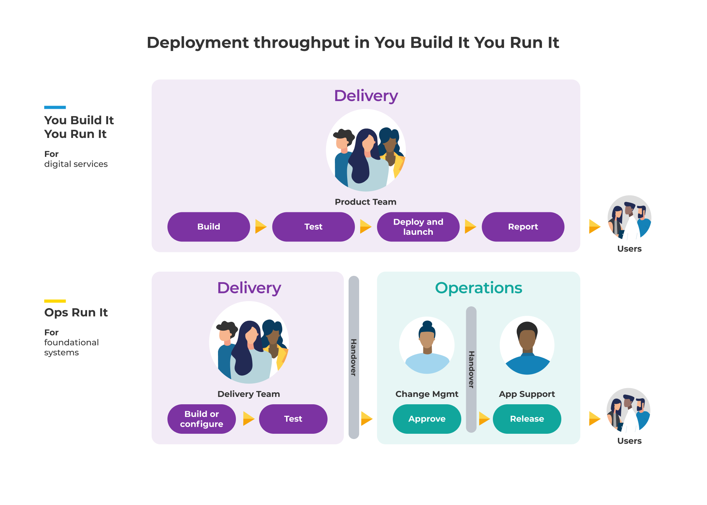
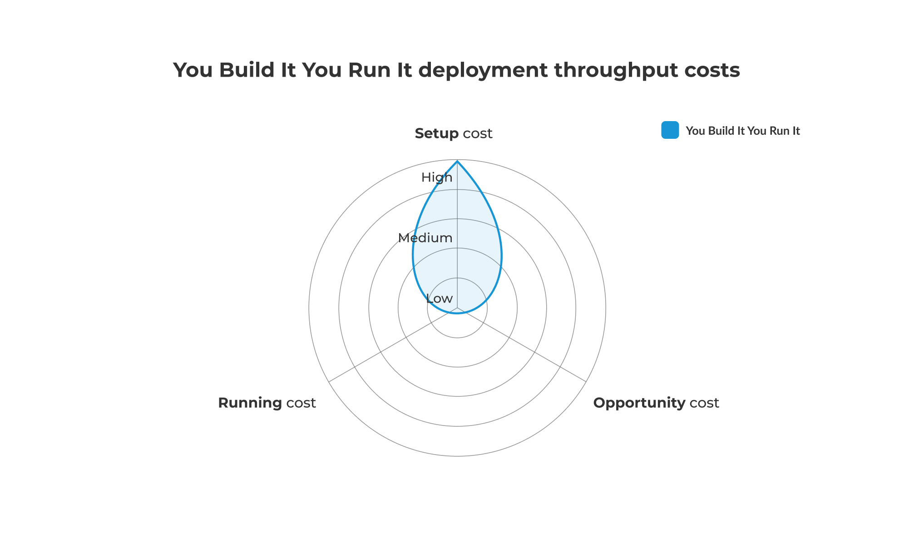

# Deployment throughput in You Build It You Run It

**Figure 1: You Build It You Run It - deployment throughput**

An on-call product team performs a production deployment when they have successfully completed product demos, automated functional testing, exploratory testing, security testing, and any other assurance checks. 

* *On-call product team reviews change*. If the deployment is a regular, low risk change then the product team chooses a pre-approved change request. If the deployment is irregular or high risk, they add a ticket into the change management queue, and fall back on a CAB meeting with the change management team. In ITIL v3, this is the difference between a standard change and a normal change. 
* *On-call product team performs deployment*. The product team uses a tool such as Jenkins or GitLab CI to orchestrate the deployment.On-call product team performs post-deployment validation. The product team does some post-deployment smoke testing, and continues to monitor live traffic.
* *On-call product team sends deployment notification*. The deployment process ends with the automated addition of a ticket into the change management queue, notifying the change management team of the deployment and its result. 

## Deployment throughput costs in You Build It You Run It

You Build It You Run It deployment throughput costs are below. We've attributed estimates of how much they contribute to the total cost of ownership for a digital service. 

|Cost Type|Frequency|Description|Impact|TCO %|
|---|---|---|---|---|
|Setup cost|One-off|Launch costs incurred in<ul><li>Deployment pipeline setup</li><li>Change management team time for setup</li></ul>|Capex cost|High|
|Opportunity cost|Per feature|Can be measured jas the cost of delay between product feature readiness and launch. Potential revenue lost, missed customer opportunities due to<ul><li>Delay waiting for a CAB meeting (irregular, high risk deployments only)</li></ul>|Lost revenue|Low|
|Running cost|Per deployment|Deployment costs incurred in completing a deployment<ul><li>Time for performing deployments, and rolling back deployments minimised due to no handovers</li></ul>|Low|

**Table 1: You Build It You Run It - deployment throughput costs**

Deployment costs are incurred as capex, as they are performed by on-call product teams themselves. 

**Figure 2: You Build It You Run It - deployment throughput costs**