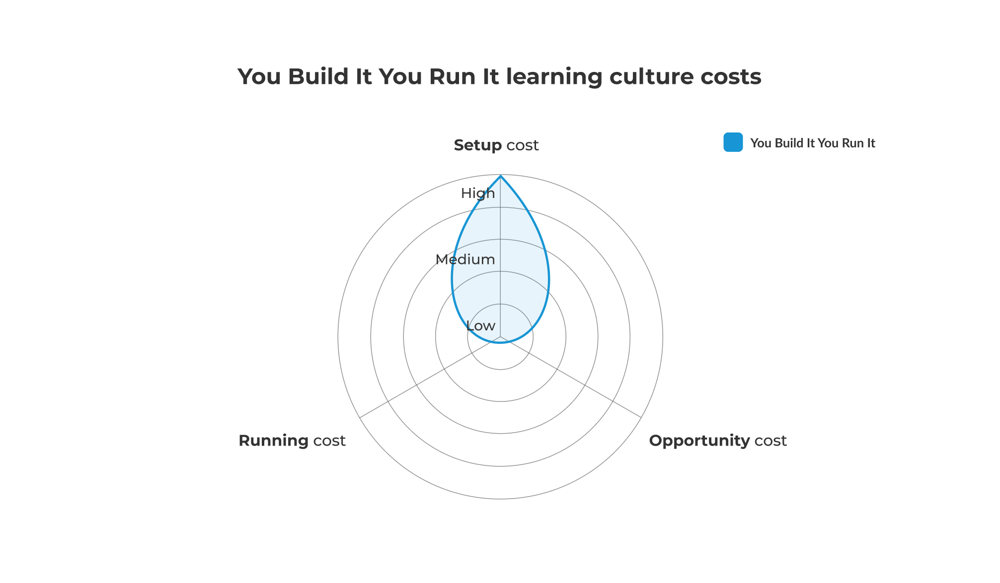

# Learning culture in You Build It You Run It

**Figure 5: You Build It You Run It - learning culture**

We describe the You Build It You Run It learning culture as predisposed to act on insights. When there is an incident of consequence, the priority for an on-call product team is to acquire a deep understanding of the problem and its resolution, and then broadcast the accumulated knowledge across the organisation.

## Generate insights

After an incident, an on-call product team is immediately allocated a period of incident analysis, for each team member that participated in incident response. It includes interviews, establishing key events during the incident, and uncovering any common learning themes. This is scheduled by the product manager, or a problem manager in accordance with ITIL v3. 

Afterwards, there is a collective post-incident review. The purpose is to generate as many insights as possible, and turn them into improvement actions where necessary. The session format is:

* Review the incident analysis reports from different team members.  
* Build a shared understanding of the incident, according to the organisational context.
* Explore the different perspectives of the team members involved in incident response.
* Discuss the human and technical contributing factors to the incident.
* Identify the most valuable learnings from the incident, and any associated improvement actions.
* Blend the newly acquired knowledge into a compelling narrative.

A team member publishes the incident narrative to the entire organisation, and there may also be internal presentations and walkthroughs.  

## Implement improvement actions

After the post-incident review, a team member records any improvement actions in the product backlog, using a ticketing system such as [Jira](https://www.atlassian.com/software/jira) or [Trello](https://www.trello.com/). This includes human factors such as accountability changes, as well as technical factors such as code fixes and configuration changes. As usual in You Build It You Run It, the product manager is responsible for balancing the priorities of those actions versus planned product features. 

## Learning culture costs in You Build It You Run It

Culture costs for You Build It You Run It are below. 

|Cost Type|Frequency|Description|Impact|TCO %|
|---|---|---|---|---|
|Setup cost|One-off|Launch costs incurred in<ul><li>Product team time for incident analysis training</li><li>Product team time for incident review training</li><li>Product team time to setup cross-team playbacks, walkthroughs, knowledge sharing</li></ul>|Capex cost|High|
|Opportunity cost|Ongoing|Can be measured jas the cost of delay between an improvement as an idea and in practice. Potential revenue lost, missed customer opportunities due to delays in improvements|Lost revenue and capex cost|Low|
|Run cost|Ongoing|Costs incurred putting an improvement idea into practice|Low|

**Table 3: You Build It You Run It - learning culture costs**

Culture costs are capex, as they are incurred by on-call product teams themselves.

**Figure 6: You Build It You Run It - learning culture costs**