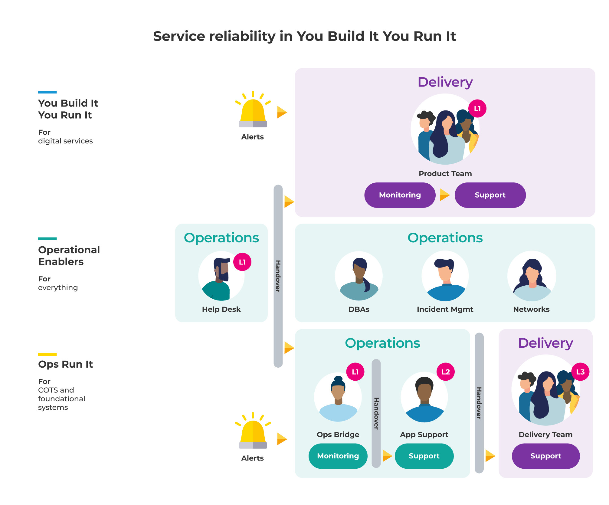
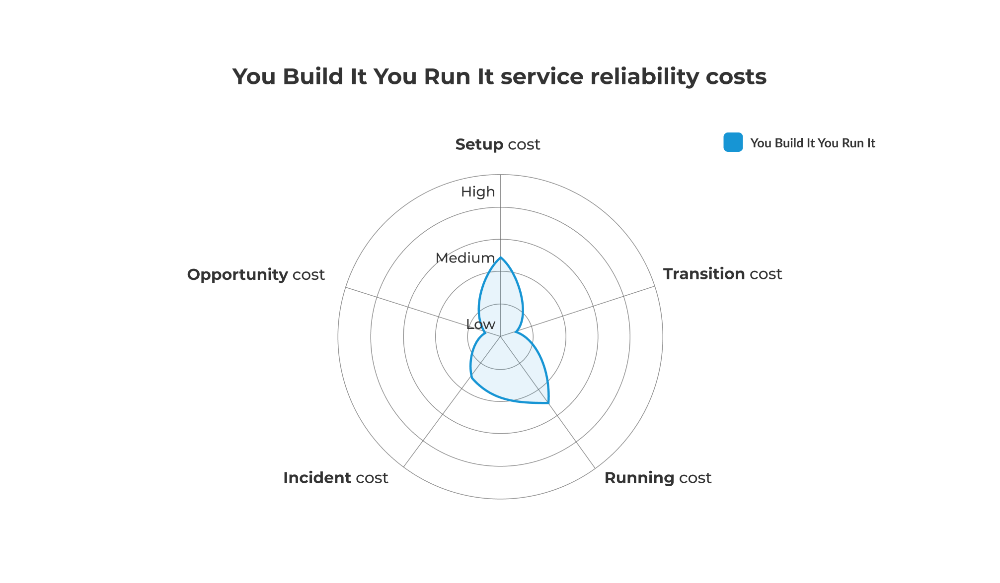

# Service reliability in You Build It You Run It

**Figure 3: You Build It You Run It - service reliability**

An on-call product team offers 24/7 production support, and they can modify all aspects of a digital service:

* Alert definitions
* Code
* Configuration
* Data
* Deployments
* Infrastructure definitions
* Logging
* Monitoring dashboards

You Build It You Run It co-exists in a hybrid operating model with [Ops Run It](https://you-build-it-you-run-it.playbooks.ee/what-is-ops-run-it), and it's important to have specialist operational teams as well as generalist, cross-functional product teams. The same operational enablers offer their scarce, deep expertise to on-call product teams for digital services, and to the application support team for foundational systems. For example, a shared DBA team can assist with database provisioning, performance, and operations. 

For governance, the senior manager for the on-call product teams is accountable for all aspects of digital service reliability. The product teams are responsible for day-to-day work in availability protection and availability restoration. They track their costs on a team-by-team basis, and make them visible for senior leaders. 

## Availability protection in You Build It You Run It

An on-call product team is responsible for availability protection. This means proactively monitoring service telemetry and updating digital services during working hours. A product team observes service health checks, logs, and metrics plumbed into different dashboards, in telemetry tools such as [AWS CloudWatch](https://aws.amazon.com/cloudwatch/) or [Grafana](https://grafana.com/). They can alter the monitorable events whenever necessary, to improve the information value of their telemetry data.

A product team also updates their digital services by adding infrastructure capacity, making configuration changes, applying fixes, and updating alerts as necessary. This is prioritised alongside feature development, as it is the product team themselves who are on-call. 

## Availability restoration in You Build It You Run It

An on-call product team is responsible for availability restoration. This means reactively responding to production alerts in and out of working hours, including evenings, weekends, and bank holidays. All service alerts are expected to be resolved by the on-call product team, and incident response is consistently prioritised over feature development. 

When an availability target is breached, an on-call product team developer receives an automated alert, via an incident response platform such as [PagerDuty](http://www.pagerduty.com) or [VictorOps](http://www.victorops.com). The responder acknowledges the alert, and a ticket is automatically created in a ticketing system such as ServiceNow, by the incident response platform.  The responder classifies and prioritises the incident, and adds more team members to the incident as required.

Responders observe their real-time service telemetry data, to understand the drift from normal to abnormal operating conditions. They diagnose the incident via their heuristics, innate service knowledge, and telemetry data. They attempt to restore availability via additional infrastructure, code changes, data fixes, configuration changes, rollbacks, and telemetry changes. 

For a high priority incident, the entire team may swarm on incident response, to minimise service unavailability. One team member acts as incident commander, to coordinate with other product teams involved in incident response, and to manage communications with senior stakeholders. Alternatively, You Build It You Run It is 100% compatible with ITIL v3, and an incident manager could be invited by the team to act as incident commander for the duration of an incident.  

## Service reliability costs in You Build It You Run It

Reliability costs are below.

|Cost Type|Frequency|Description|Impact|TCO %|
|---|---|---|---|---|
|Setup cost|One-off|Launch costs incurred in<ul><li>License purchases</li><li>Product team time for telemetry install</li><li>Product team time for on-call schedule agreement</li><li>Product team time to setup live access Product team time for any operational training necessary</li></ul>|Capex cost|Medium|
|Transition cost|One-off|Launch costs incurred in<ul><li>Product team time for runbooks|Capex cost</li></ul>|Low|
|Running cost|Ongoing|Regular costs incurred in product team time for<ul><li>Deploying code changes</li><li>Applying data fixes</li><li>Adding infrastructure capacity</li><li>Monitoring operating conditions</li><li>Performing rollbacks</li><li>Updating telemetry tools</li><li>Doing on-call standby out of hours</li></ul>|Capex cost|Medium|
|Incident cost|Per incident|Incident response costs incurred in product team time for<ul><li>Investigating and diagnosing problems</li><li>Identifying and agreeing on solutions including code changes</li><li>configuration updates, adding infrastructure capacity</li><li>On-call callout out of hours</li></ul>|Capex cost|Low to medium|
|Opportunity cost|Per incident|Can be measured as the cost of delay between incident start and incident finish. Caused by service unavailability, missed opportunities with customers, and delays in further feature development|Revenue loss and costs incurred|Low|

**Table 2: You Build It You Run It - service reliability costs**

If an IT department has segregated Delivery and Operations functions, on-call funding can be either capex or opex. You Build It You Run It is most effective when [Delivery owns the on-call budget](https://you-build-it-you-run-it.playbooks.ee/practices/governance), with the senior manager accountable for on-call funding as capex spend. However, a frequent pitfall in large organisations is [on-call budget stuck in Operations](https://you-build-it-you-run-it.playbooks.ee/pitfalls), leaving the senior Operations manager accountable for on-call funding as opex spend. 

**Figure 4: You Build It You Run It - service reliability costs**